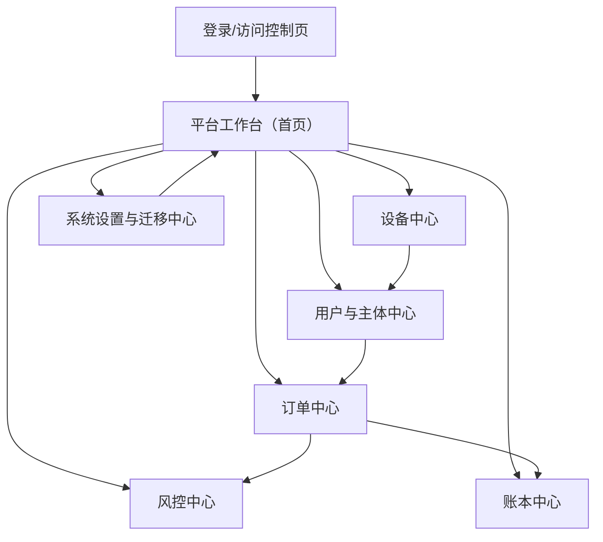

## 1. Product Overview
KhmerX Credit OS 是面向 KhmerX 四个业务模块的统一“信用操作系统”底座平台，提供统一用户、风控、账本、订单、设备五大域能力。
通过共享数据模型、权限体系与审计能力，降低多业务重复建设成本，并支持存量系统按阶段平滑迁移。

## 2. Core Features

### 2.1 User Roles
| 角色 | 注册/开通方式 | 核心权限 |
|------|----------------|----------|
| 平台管理员 | 由超级管理员创建/邀请 | 管理租户/组织、角色权限、系统参数、迁移任务、全量审计查看 |
| 业务运营 | 由管理员创建/邀请 | 查看/维护用户主体信息、发起订单、查询设备、处理异常 |
| 风控运营 | 由管理员创建/邀请 | 配置风控策略与规则、发起/回放决策、处理命中与人工复核 |
| 财务/账务 | 由管理员创建/邀请 | 配置账本、查看与导出分录、执行对账与关账、处理冲正 |
| 审计只读 | 由管理员创建/邀请 | 全域只读查询、查看操作与决策链路、导出审计报告 |

### 2.2 Feature Module
平台（统一底座 + 四业务模块复用）由以下页面组成：
1. **登录/访问控制页**：账号登录、租户/组织选择（如适用）、权限校验与退出登录。
2. **平台工作台（首页）**：四业务模块入口、关键指标概览、待办列表、全局搜索。
3. **用户与主体中心**：统一用户档案、身份/联系人/地址、主体关系（用户-订单-设备）、风险标签与黑白名单视图。
4. **风控中心**：策略/规则配置、决策请求与回放、命中明细、人工复核、风控审计链路。
5. **订单中心**：统一订单视图、订单生命周期、与风控/账本联动、异常单处理。
6. **账本中心**：账户体系（逻辑科目/账户）、分录流水、对账与导出、冲正与更正。
7. **设备中心**：设备档案、绑定关系、状态/健康、设备风控事件与处置记录。
8. **系统设置与迁移中心**：组织与 RBAC、系统参数、数据字典/枚举、迁移任务编排与对账。

> 说明：你提到的“四业务模块”在本 PRD 中以“模块A/B/C/D”抽象表示；统一底座必须确保它们共用同一套用户/风控/账本/订单/设备域模型与权限审计能力。

### 2.3 Page Details
| Page Name | Module Name | Feature description |
|-----------|-------------|---------------------|
| 登录/访问控制页 | 登录 | 完成账号登录；校验组织/角色；失败提示与安全退出 |
| 平台工作台（首页） | 全局导航与权限 | 展示四模块入口；基于权限显示菜单；提供全局搜索（用户/订单/设备） |
| 平台工作台（首页） | 指标与待办 | 展示关键指标（订单量、风险命中、入账异常等的概览）；展示待办（复核、异常、对账） |
| 用户与主体中心 | 用户档案 | 查询/查看用户基础信息；展示用户关联订单与设备；展示风险标签/状态 |
| 用户与主体中心 | 主体关系图谱 | 以列表/关系视图呈现“用户-订单-设备”链路；支持按时间与状态筛选 |
| 风控中心 | 策略与规则管理 | 创建/编辑/启停策略与规则；配置规则版本；记录变更原因与审批备注（如适用） |
| 风控中心 | 决策与回放 | 发起风控决策；展示输入特征与命中规则；支持回放历史决策以定位差异 |
| 风控中心 | 人工复核 | 查看命中明细；记录复核结论与理由；产出复核结果并回写到订单状态 |
| 订单中心 | 订单统一视图 | 查询/筛选订单；查看订单生命周期与关键字段；展示关联风控决策与账本分录 |
| 订单中心 | 异常与更正 | 标记与处理异常订单；触发冲正/更正流程（与账本联动）；保留完整审计轨迹 |
| 账本中心 | 账户与分录 | 查看账户余额与变动；按订单/用户追溯分录；导出分录明细 |
| 账本中心 | 对账与关账 | 执行周期性对账；标记差异与处理结论；生成关账快照（如适用） |
| 设备中心 | 设备档案与绑定 | 查询设备；查看设备状态；维护设备与用户/订单绑定关系（含历史） |
| 设备中心 | 设备事件与处置 | 展示设备相关风险事件；记录处置动作与结果；关联到订单/用户链路 |
| 系统设置与迁移中心 | RBAC 与参数 | 管理组织、角色、权限；配置系统参数与枚举字典；查看系统审计日志 |
| 系统设置与迁移中心 | 迁移任务与对账 | 创建迁移批次；配置映射与校验规则；展示迁移进度、失败重试、迁移后对账报告 |

## 3. Core Process
### 3.1 统一底座的核心业务流（模块A/B/C/D共用）
1. 运营在工作台中通过全局搜索定位用户/订单/设备。
2. 新增或补全用户主体信息，形成统一用户档案与关联关系（用户-订单-设备）。
3. 发起订单创建或订单变更时，系统在订单域触发风控决策：记录“决策输入-命中-输出”完整链路。
4. 风控输出结果驱动订单状态流转；若命中需复核，则进入人工复核待办。
5. 订单关键状态变化（放款/出账/还款/冲正等）触发账本入账，形成可追溯分录；财务执行对账与导出。
6. 设备域持续沉淀设备档案与事件处置记录，并可反哺风控标签与订单异常处置。

### 3.2 分阶段 MVP 交付方案（建议）
- Phase 0（平台骨架）：统一登录与 RBAC、工作台框架、全局审计日志、统一数据字典。
- Phase 1（域模型 MVP）：统一用户/订单/设备“只读聚合视图” + 统一查询与全局搜索；风控/账本先以关联展示为主。
- Phase 2（风控闭环 MVP）：策略/规则管理、决策链路沉淀、人工复核待办；订单状态与风控结果联动。
- Phase 3（账本闭环 MVP）：账户/分录、对账与导出、冲正更正；实现“订单-分录”全链路追溯。
- Phase 4（四模块迁移完成）：模块A/B/C/D 完成统一底座改造与权限、审计、数据口径收敛。

### 3.3 存量系统迁移方案（建议）
- 迁移准备：冻结字段口径与枚举；建立“统一域模型”与“旧系统字段”映射；定义对账口径（订单口径、账本口径、风险口径）。
- 双写阶段：旧系统继续提供对外能力，新平台作为主查询入口；关键写入（订单/风控结果/分录）按域实现双写并做差异比对。
- 灰度切换：按模块/地区/渠道分批切换写入口到新平台；建立回滚开关与降级策略。
- 全量切换：旧系统变为只读归档；迁移中心输出最终对账报告并完成审计签收。

### 3.4 页面导航流程图
