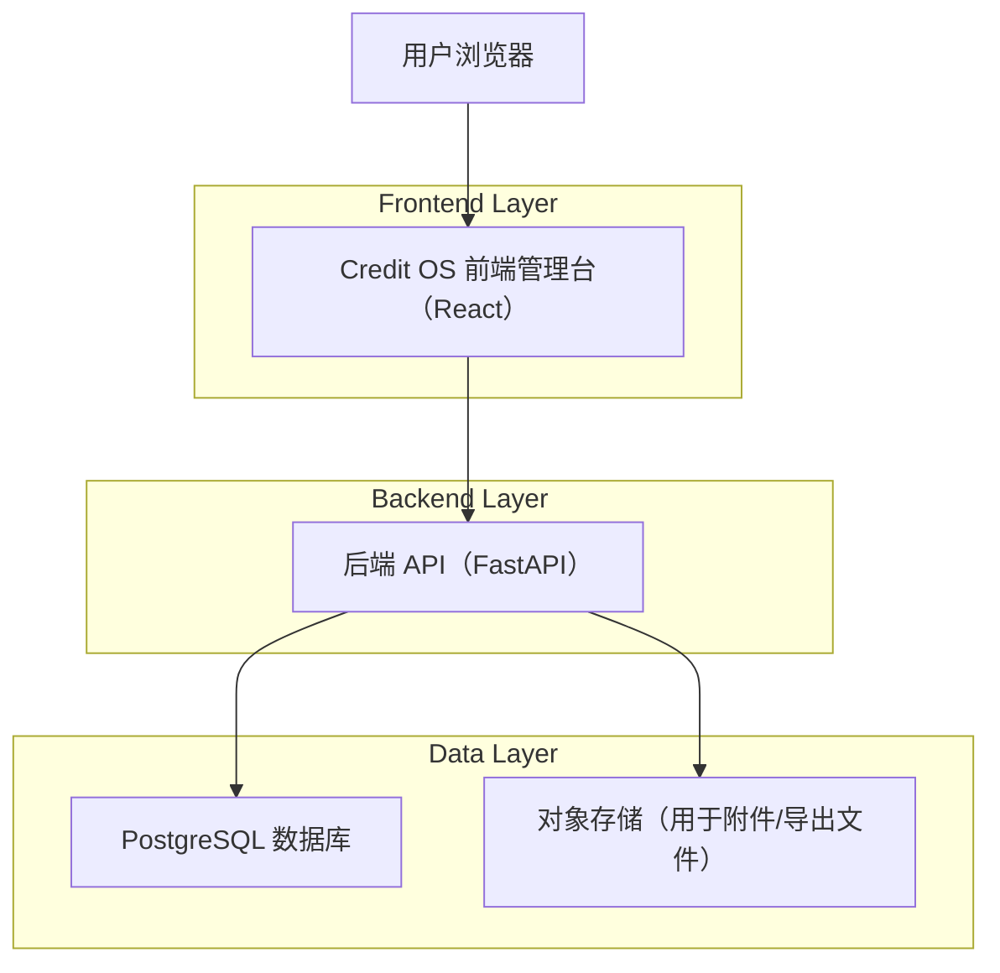
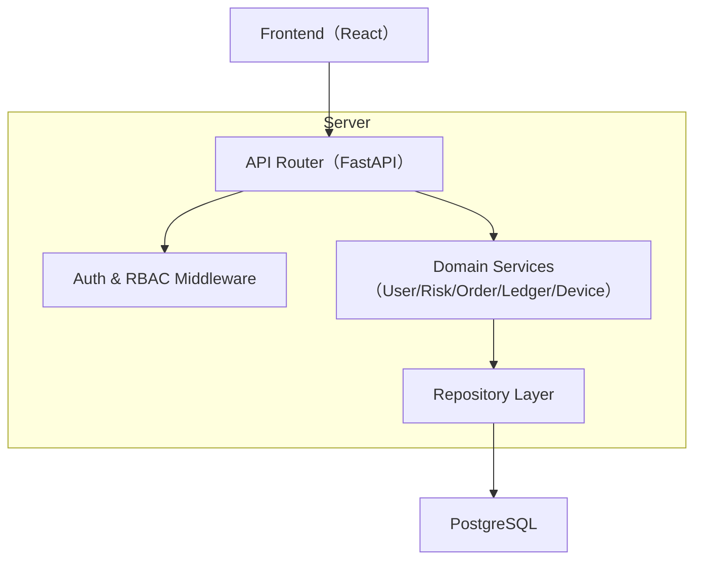
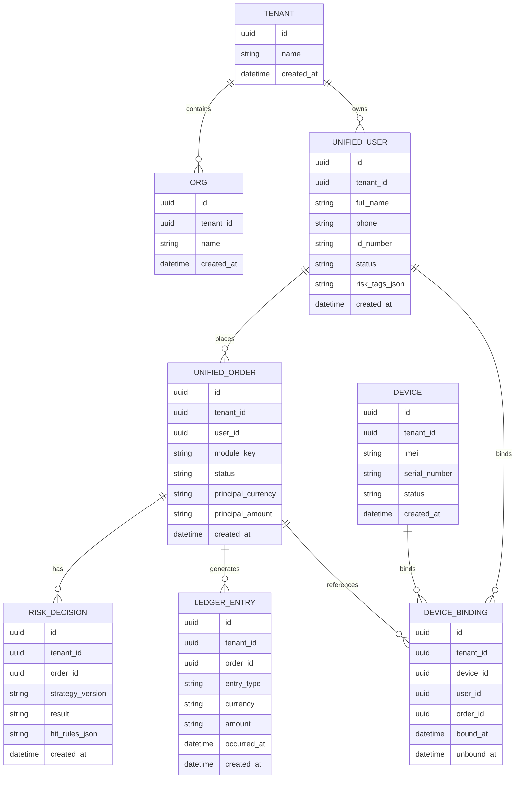

## 1.Architecture design


> 说明：当前仓库已存在 FastAPI 后端与多个前端子应用（如风控管理台）。本次“Credit OS 统一平台”建议在现有后端基础上，以“统一域模型 + 统一权限审计 + 统一接口层”方式整合四业务模块。

## 2.Technology Description
- Frontend: React@18 + TypeScript + vite + tailwindcss@3
- Backend: FastAPI (Python)
- Database: PostgreSQL

## 3.Route definitions
| Route | Purpose |
|-------|---------|
| /login | 登录与会话建立 |
| /app | 平台工作台壳（左侧导航 + 顶栏 + 内容区） |
| /app/users | 用户与主体中心：统一用户档案与关系视图 |
| /app/risk | 风控中心：策略/规则、决策回放、复核待办 |
| /app/orders | 订单中心：统一订单视图、异常处理 |
| /app/ledger | 账本中心：账户/分录、对账与导出 |
| /app/devices | 设备中心：设备档案、绑定与事件处置 |
| /app/system | 系统设置与迁移中心：RBAC、参数、迁移任务 |

## 4.API definitions
### 4.1 Core Types (TypeScript)
```ts
export type ID = string;

export type TenantId = ID;
export type OrgId = ID;
export type UserId = ID;
export type OrderId = ID;
export type DeviceId = ID;
export type RiskDecisionId = ID;
export type LedgerEntryId = ID;

export type Money = {
  currency: "KHR" | "USD";
  amount: string; // decimal string
};

export type UnifiedUser = {
  id: UserId;
  tenantId: TenantId;
  fullName: string;
  phone?: string;
  idNumber?: string;
  status: "active" | "frozen" | "closed";
  riskTags: string[];
  createdAt: string;
};

export type UnifiedOrder = {
  id: OrderId;
  tenantId: TenantId;
  userId: UserId;
  moduleKey: "moduleA" | "moduleB" | "moduleC" | "moduleD"; // 四业务模块标识
  status: "draft" | "pending_risk" | "approved" | "rejected" | "active" | "closed" | "exception";
  principal: Money;
  createdAt: string;
};

export type RiskDecision = {
  id: RiskDecisionId;
  tenantId: TenantId;
  orderId: OrderId;
  strategyVersion: string;
  result: "pass" | "reject" | "review";
  hitRules: Array<{ ruleKey: string; reason: string }>;
  createdAt: string;
};

export type LedgerEntry = {
  id: LedgerEntryId;
  tenantId: TenantId;
  orderId: OrderId;
  entryType: "disbursement" | "repayment" | "fee" | "adjustment" | "reversal";
  amount: Money;
  occurredAt: string;
  createdAt: string;
};

export type Device = {
  id: DeviceId;
  tenantId: TenantId;
  imei?: string;
  serialNumber?: string;
  status: "new" | "bound" | "lost" | "retired";
  createdAt: string;
};
```

### 4.2 Core API (HTTP)
- 统一搜索
  - GET /api/creditos/search?q=...
- 用户域
  - GET /api/creditos/users
  - GET /api/creditos/users/{id}
- 订单域
  - GET /api/creditos/orders
  - GET /api/creditos/orders/{id}
- 风控域
  - GET /api/creditos/risk/strategies
  - POST /api/creditos/risk/decisions
  - GET /api/creditos/risk/decisions/{id}
- 账本域
  - GET /api/creditos/ledger/accounts
  - GET /api/creditos/ledger/entries
- 设备域
  - GET /api/creditos/devices
  - POST /api/creditos/devices/{id}/bind
- 迁移域
  - POST /api/creditos/migration/batches
  - GET /api/creditos/migration/batches/{id}

## 5.Server architecture diagram


## 6.Data model

### 6.1 Data model definition


### 6.2 Data Definition Language
Tenant / Org
```sql
CREATE TABLE tenant (
  id UUID PRIMARY KEY DEFAULT gen_random_uuid(),
  name VARCHAR(120) NOT NULL,
  created_at TIMESTAMPTZ NOT NULL DEFAULT NOW()
);

CREATE TABLE org (
  id UUID PRIMARY KEY DEFAULT gen_random_uuid(),
  tenant_id UUID NOT NULL,
  name VARCHAR(120) NOT NULL,
  created_at TIMESTAMPTZ NOT NULL DEFAULT NOW()
);

CREATE INDEX idx_org_tenant_id ON org(tenant_id);
```

Unified User / Order
```sql
CREATE TABLE unified_user (
  id UUID PRIMARY KEY DEFAULT gen_random_uuid(),
  tenant_id UUID NOT NULL,
  full_name VARCHAR(120) NOT NULL,
  phone VARCHAR(40),
  id_number VARCHAR(80),
  status VARCHAR(20) NOT NULL DEFAULT 'active',
  risk_tags_json JSONB NOT NULL DEFAULT '[]'::jsonb,
  created_at TIMESTAMPTZ NOT NULL DEFAULT NOW()
);

CREATE INDEX idx_unified_user_tenant_id ON unified_user(tenant_id);
CREATE INDEX idx_unified_user_phone ON unified_user(phone);

CREATE TABLE unified_order (
  id UUID PRIMARY KEY DEFAULT gen_random_uuid(),
  tenant_id UUID NOT NULL,
  user_id UUID NOT NULL,
  module_key VARCHAR(30) NOT NULL, -- moduleA/moduleB/moduleC/moduleD
  status VARCHAR(30) NOT NULL,
  principal_currency VARCHAR(3) NOT NULL,
  principal_amount NUMERIC(18,2) NOT NULL,
  created_at TIMESTAMPTZ NOT NULL DEFAULT NOW()
);

CREATE INDEX idx_unified_order_tenant_id ON unified_order(tenant_id);
CREATE INDEX idx_unified_order_user_id ON unified_order(user_id);
CREATE INDEX idx_unified_order_module_key ON unified_order(module_key);
```

Risk / Ledger / Device
```sql
CREATE TABLE risk_decision (
  id UUID PRIMARY KEY DEFAULT gen_random_uuid(),
  tenant_id UUID NOT NULL,
  order_id UUID NOT NULL,
  strategy_version VARCHAR(80) NOT NULL,
  result VARCHAR(20) NOT NULL, -- pass/reject/review
  hit_rules_json JSONB NOT NULL DEFAULT '[]'::jsonb,
  created_at TIMESTAMPTZ NOT NULL DEFAULT NOW()
);

CREATE INDEX idx_risk_decision_order_id ON risk_decision(order_id);
CREATE INDEX idx_risk_decision_tenant_id ON risk_decision(tenant_id);

CREATE TABLE ledger_entry (
  id UUID PRIMARY KEY DEFAULT gen_random_uuid(),
  tenant_id UUID NOT NULL,
  order_id UUID NOT NULL,
  entry_type VARCHAR(30) NOT NULL,
  currency VARCHAR(3) NOT NULL,
  amount NUMERIC(18,2) NOT NULL,
  occurred_at TIMESTAMPTZ NOT NULL,
  created_at TIMESTAMPTZ NOT NULL DEFAULT NOW()
);

CREATE INDEX idx_ledger_entry_order_id ON ledger_entry(order_id);
CREATE INDEX idx_ledger_entry_occurred_at ON ledger_entry(occurred_at DESC);

CREATE TABLE device (
  id UUID PRIMARY KEY DEFAULT gen_random_uuid(),
  tenant_id UUID NOT NULL,
  imei VARCHAR(32),
  serial_number VARCHAR(64),
  status VARCHAR(20) NOT NULL DEFAULT 'new',
  created_at TIMESTAMPTZ NOT NULL DEFAULT NOW()
);

CREATE INDEX idx_device_tenant_id ON device(tenant_id);
CREATE INDEX idx_device_imei ON device(imei);

CREATE TABLE device_binding (
  id UUID PRIMARY KEY DEFAULT gen_random_uuid(),
  tenant_id UUID NOT NULL,
  device_id UUID NOT NULL,
  user_id UUID,
  order_id UUID,
  bound_at TIMESTAMPTZ NOT NULL DEFAULT NOW(),
  unbound_at TIMESTAMPTZ
);

CREATE INDEX idx_device_binding_device_id ON device_binding(device_id);
CREATE INDEX idx_device_binding_user_id ON device_binding(user_id);
CREATE INDEX idx_device_binding_order_id ON device_binding(order_id);
```

权限建议（与具体权限模型配套）
```sql
-- 如果采用 Supabase/RLS：建议 anon 只读部分聚合视图，authenticated 才可写。
-- 若继续使用后端鉴权：数据库层至少区分只读账号与读写账号，并保留审计表。
```