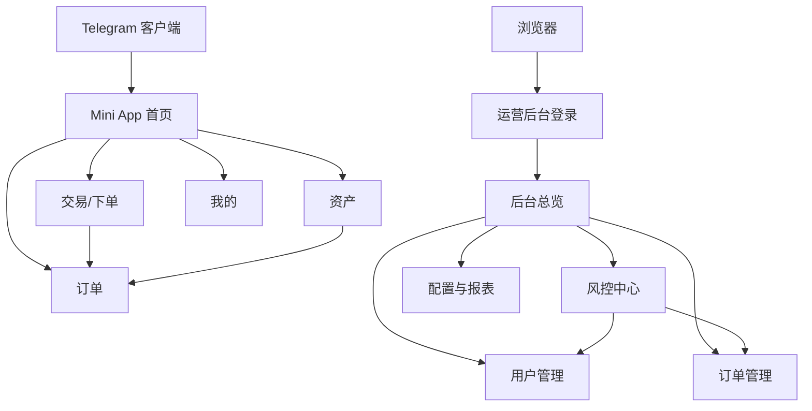

## 1. Product Overview
KhmerX Telegram Mini App 面向 C 端用户完成核心业务闭环（浏览-下单-订单-资产-我的）。
运营后台用于运营/风控人员进行用户、订单、资金、风控策略与指标监控。

## 2. Core Features

### 2.1 User Roles
| 角色 | 注册/登录方式 | 核心权限 |
|------|--------------|----------|
| Mini App 用户 | Telegram 授权登录（基于 initData） | 浏览业务信息、发起下单、查看订单与资产、查看风控提示 |
| 运营管理员 | 后台账号密码登录 | 查看指标、管理用户/订单/资金、配置基础参数 |
| 风控管理员 | 后台账号密码登录 | 查看风险看板、处置风险事件、配置/启停风控规则 |

### 2.2 Feature Module
本产品需求由以下最小页面组成：
1. **Mini App 首页（模块1）**：关键入口、公告/活动、风控提示概览。
2. **Mini App 交易/下单（模块2）**：报价/费率展示、下单、风控拦截提示。
3. **Mini App 订单（模块3）**：订单列表、订单详情、状态流转展示。
4. **Mini App 资产（模块4）**：余额与流水、充提/划转入口（如有）。
5. **Mini App 我的（模块5）**：个人信息、绑定信息、帮助与客服入口。
6. **运营后台登录**：管理员鉴权。
7. **运营后台总览**：核心指标、异常/风险摘要。
8. **运营后台用户与订单管理**：用户画像、订单查询与处置。
9. **运营后台风控中心**：风险事件、规则配置、命中统计。
10. **运营后台配置与报表**：业务配置、数据导出。

### 2.3 Page Details
| Page Name | Module Name | Feature description |
|-----------|-------------|---------------------|
| Mini App 首页 | 导航与快捷入口 | 展示 5 模块主导航；提供核心操作入口（进入交易/订单/资产/我的）。 |
| Mini App 首页 | 公告/活动 | 展示运营配置的公告与活动位；支持跳转到指定模块或外链（如有）。 |
| Mini App 首页 | 风控提示概览 | 展示账号状态（正常/受限/冻结等）与关键提醒；点击进入风险说明/申诉指引（如配置）。 |
| Mini App 交易/下单 | 报价与费率 | 展示实时/准实时价格、手续费与限额信息；提示更新时间。 |
| Mini App 交易/下单 | 下单表单 | 输入金额/数量并提交；展示确认弹窗与预计到账；失败时展示可读错误。 |
| Mini App 交易/下单 | 风控拦截展示 | 当命中风控规则时，展示拦截原因、建议操作（更换方式/稍后重试/联系客服）。 |
| Mini App 订单 | 订单列表 | 按时间倒序展示；支持按状态筛选（进行中/已完成/已取消/失败）。 |
| Mini App 订单 | 订单详情 | 展示订单号、金额、费率、状态时间线与关键操作指引；支持复制信息。 |
| Mini App 资产 | 余额概览 | 展示各资产余额与可用/冻结；展示总览。 |
| Mini App 资产 | 流水明细 | 展示充值/提现/交易等流水；支持按类型/时间筛选。 |
| Mini App 我的 | 个人信息 | 展示 Telegram 基础信息与系统侧用户标识；展示绑定/认证状态。 |
| Mini App 我的 | 帮助与客服 | 提供常见问题入口与联系客服跳转；展示工单/咨询指引（如有）。 |
| 运营后台登录 | 管理员登录 | 使用账号密码登录；支持退出登录与会话失效提示。 |
| 运营后台总览 | 核心指标看板 | 展示 DAU、新增、下单量、成交量/金额、成功率、失败原因 Top、风险命中数。 |
| 运营后台总览 | 异常摘要 | 展示高风险用户数、待处理风险事件数、订单异常数；支持一键跳转列表。 |
| 运营后台用户与订单管理 | 用户列表/详情 | 搜索/筛选用户；查看用户基础信息、行为摘要、风险标签、历史订单与处置记录。 |
| 运营后台用户与订单管理 | 订单列表/详情 | 多条件查询订单；查看状态流转与失败原因；支持人工备注与处置。 |
| 运营后台风控中心 | 风险事件列表 | 展示事件类型、命中规则、严重级别、状态（待处理/已处理）；支持指派与备注。 |
| 运营后台风控中心 | 风控规则配置 | 新增/编辑/启停规则；配置阈值与生效范围；展示命中统计与近期趋势。 |
| 运营后台配置与报表 | 业务配置 | 配置公告位、活动位、限额/费率等基础参数；支持灰度/立即生效（如配置）。 |
| 运营后台配置与报表 | 报表导出 | 按时间导出用户/订单/风险事件数据；导出任务可追踪状态。 |

## 3. Core Process
- Mini App 用户流：打开 Telegram Mini App → initData 授权登录 → 首页查看公告与风控状态 → 进入交易模块查看报价并下单 → 进入订单模块跟踪状态 → 在资产模块查看余额与流水 → 在我的模块查看信息与联系客服。
- 运营/风控流：后台登录 → 总览查看核心指标与异常摘要 → 进入用户/订单定位问题 → 在风控中心查看命中事件并处置（备注/指派/调整规则）→ 在配置与报表更新公告/阈值并导出数据。

