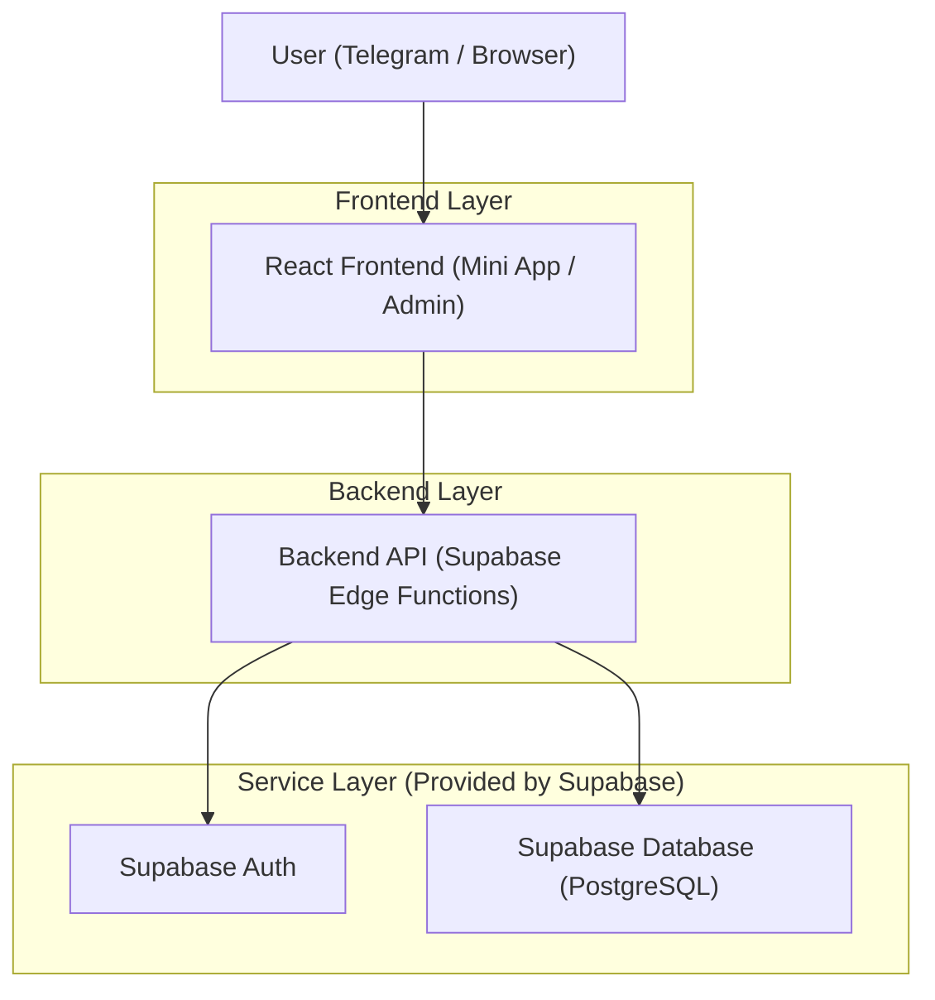
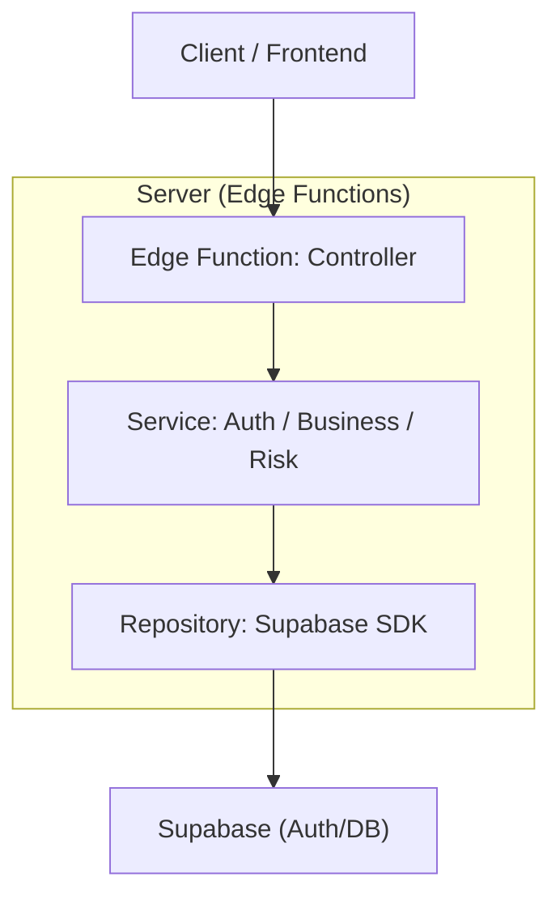
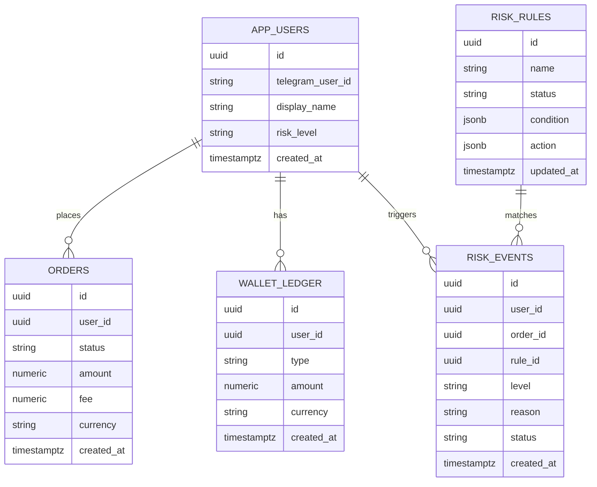

## 1.Architecture design


## 2.Technology Description
- Frontend: React@18 + TypeScript + vite + tailwindcss@3
- Backend: Supabase（Auth + Database + Edge Functions）

## 3.Route definitions
| Route | Purpose |
|-------|---------|
| / | Mini App 首页（模块导航/公告/风控提示） |
| /trade | Mini App 交易/下单 |
| /orders | Mini App 订单列表 |
| /orders/:id | Mini App 订单详情 |
| /assets | Mini App 资产与流水 |
| /me | Mini App 我的 |
| /admin/login | 运营后台登录 |
| /admin | 后台总览 |
| /admin/users | 用户管理 |
| /admin/orders | 订单管理 |
| /admin/risk | 风控中心 |
| /admin/settings | 配置与报表 |

## 4.API definitions (If it includes backend services)
### 4.1 Core API
Telegram 侧登录（服务端校验 initData 并创建会话）
```
POST /api/tg/auth
```

Mini App
```
GET  /api/me
GET  /api/quotes
POST /api/orders
GET  /api/orders
GET  /api/orders/:id
GET  /api/wallet/balances
GET  /api/wallet/ledger
```

Admin
```
POST /api/admin/auth/login
GET  /api/admin/metrics/overview
GET  /api/admin/users
GET  /api/admin/users/:id
GET  /api/admin/orders
GET  /api/admin/orders/:id
GET  /api/admin/risk/events
POST /api/admin/risk/events/:id/resolve
GET  /api/admin/risk/rules
POST /api/admin/risk/rules
PATCH /api/admin/risk/rules/:id
```

共享 TypeScript 类型（前后端通用）
```ts
export type RiskLevel = 'low' | 'medium' | 'high' | 'blocked'
export type OrderStatus = 'created' | 'processing' | 'success' | 'failed' | 'canceled'

export interface AppUser {
  id: string
  telegramUserId: string
  displayName: string
  riskLevel: RiskLevel
  createdAt: string
}

export interface Order {
  id: string
  userId: string
  status: OrderStatus
  amount: number
  fee: number
  currency: string
  createdAt: string
}

export interface RiskEvent {
  id: string
  userId: string
  orderId?: string
  ruleId: string
  level: RiskLevel
  reason: string
  status: 'open' | 'resolved'
  createdAt: string
}
```

## 5.Server architecture diagram (If it includes backend services)


## 6.Data model(if applicable)
### 6.1 Data model definition


### 6.2 Data Definition Language
User Table（app_users）
```
CREATE TABLE app_users (
  id UUID PRIMARY KEY DEFAULT gen_random_uuid(),
  telegram_user_id VARCHAR(64) NOT NULL,
  display_name VARCHAR(128) NOT NULL,
  risk_level VARCHAR(16) DEFAULT 'low',
  created_at TIMESTAMPTZ DEFAULT NOW()
);
CREATE UNIQUE INDEX idx_app_users_telegram_user_id ON app_users(telegram_user_id);

GRANT SELECT ON app_users TO anon;
GRANT ALL PRIVILEGES ON app_users TO authenticated;
```

Orders（orders）
```
CREATE TABLE orders (
  id UUID PRIMARY KEY DEFAULT gen_random_uuid(),
  user_id UUID NOT NULL,
  status VARCHAR(16) NOT NULL,
  amount NUMERIC(18,6) NOT NULL,
  fee NUMERIC(18,6) NOT NULL,
  currency VARCHAR(16) NOT NULL,
  created_at TIMESTAMPTZ DEFAULT NOW()
);
CREATE INDEX idx_orders_user_id_created_at ON orders(user_id, created_at DESC);

GRANT SELECT ON orders TO anon;
GRANT ALL PRIVILEGES ON orders TO authenticated;
```

Risk（risk_rules / risk_events）
```
CREATE TABLE risk_rules (
  id UUID PRIMARY KEY DEFAULT gen_random_uuid(),
  name VARCHAR(128) NOT NULL,
  status VARCHAR(16) DEFAULT 'enabled',
  condition JSONB NOT NULL,
  action JSONB NOT NULL,
  updated_at TIMESTAMPTZ DEFAULT NOW()
);

CREATE TABLE risk_events (
  id UUID PRIMARY KEY DEFAULT gen_random_uuid(),
  user_id UUID NOT NULL,
  order_id UUID,
  rule_id UUID NOT NULL,
  level VARCHAR(16) NOT NULL,
  reason TEXT NOT NULL,
  status VARCHAR(16) DEFAULT 'open',
  created_at TIMESTAMPTZ DEFAULT NOW()
);
CREATE INDEX idx_risk_events_created_at ON risk_events(created_at DESC);

GRANT SELECT ON risk_rules TO anon;
GRANT SELECT ON risk_events TO anon;
GRANT ALL PRIVILEGES ON risk_rules TO authenticated;
GRANT ALL PRIVILEGES ON risk_events TO authenticated;
```