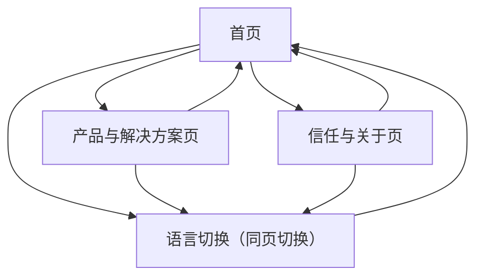

## 1. Product Overview
khmerx.org 官网“形象完善”旨在以更清晰一致的品牌表达与可验证的信任背书，提升访客对 KhmerX 的理解与信任。
同时以明显的产品入口与结构化多语言信息架构，降低访客从“了解”到“进入产品/服务”的路径成本。

## 2. Core Features

### 2.2 Feature Module
本次官网需求由以下最小页面组成：
1. **首页**：品牌主叙事（主视觉/一句话定位）、信任背书摘要、产品入口卡片、多语言切换、关键内容导览。
2. **产品与解决方案页**：产品矩阵与分组、每个产品的价值点与适用人群、统一入口（站内或外链）与跳转说明。
3. **信任与关于页**：公司/团队介绍、里程碑、资质与合规信息、合作伙伴/媒体提及、FAQ（面向信任与风控疑虑）。

### 2.3 Page Details
| Page Name | Module Name | Feature description |
|---|---|---|
| 首页 | 顶部导航与语言切换 | 展示 Logo/主导航；提供语言切换（保持当前页面语义一致的跳转）；在移动端折叠菜单。 |
| 首页 | 品牌主视觉（Hero） | 呈现一句话定位与 1–2 条核心价值点；提供“进入产品/查看解决方案”主 CTA；确保视觉与品牌色、字体一致。 |
| 首页 | 信任背书摘要 | 展示 3–6 个关键信任要素摘要（如合作伙伴/数据与安全/合规说明/媒体提及/里程碑），并链接到“信任与关于页”。 |
| 首页 | 产品入口区 | 以卡片/网格方式呈现产品矩阵入口（名称、短描述、状态标签如“Beta/已上线”、入口按钮）；支持外链打开策略说明。 |
| 首页 | 内容导览与页脚 | 提供到“产品与解决方案/信任与关于”的次级入口；页脚放置版权、条款/隐私（如有现成链接则接入）、联系方式/社媒入口（如现有）。 |
| 产品与解决方案页 | 产品矩阵与分组 | 按业务线/人群/场景分组展示产品；每个产品给出一致信息结构：价值点、适用场景、入口按钮。 |
| 产品与解决方案页 | 入口规范与跳转说明 | 对站内页面/外部产品（如 Telegram/小程序/应用）统一入口文案与跳转策略（新开/同窗）；明确“你将前往哪里”。 |
| 产品与解决方案页 | 可信承诺条 | 在页面底部提供简短可信承诺（安全/合规/透明）并链接到“信任与关于页”对应锚点。 |
| 信任与关于页 | 组织与团队信息 | 介绍 KhmerX 的使命、团队/组织信息（以你已有公开信息为准），提供可验证信息的呈现位置。 |
| 信任与关于页 | 资质/合规/安全说明 | 展示合规与风控相关说明（以你已具备或可公开的信息为准）；提供可下载/可跳转的证明材料入口（如已有链接）。 |
| 信任与关于页 | 合作伙伴/媒体/案例 | 展示合作伙伴 Logo（如有授权）、媒体提及或案例摘要；支持跳转到外部报道/案例页（如已有链接）。 |
| 信任与关于页 | FAQ（信任向） | 覆盖常见疑问：我们是谁/做什么、如何保障安全、与哪些主体合作、产品入口指向哪里等；支持锚点跳转。 |

## 3. Core Process
- 访客浏览流程：你进入首页 → 通过主视觉理解“KhmerX 是什么/能解决什么” → 在产品入口区选择并进入具体产品 → 如对可信度有疑问，进入“信任与关于页”查看背书与 FAQ → 返回继续进入产品。
- 多语言流程：你在任意页面切换语言 → 系统切换到同一语义页面的对应语言版本（尽量保持同一路由层级与锚点）→ 你的浏览状态（当前页）保持不变。

