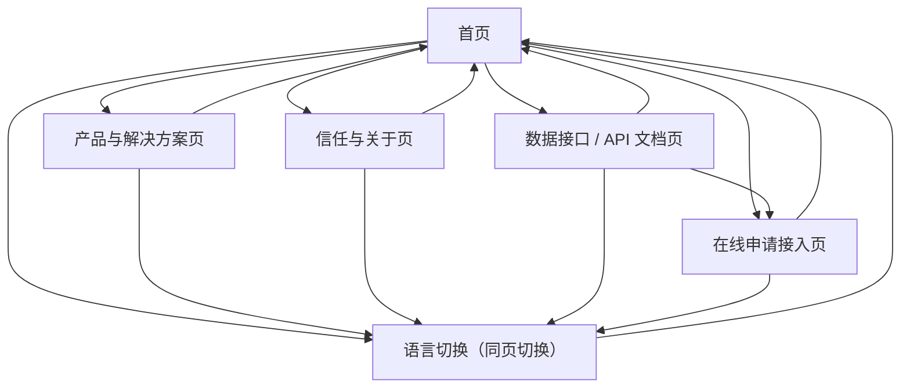

## 1. Product Overview
khmerx.org 官网“形象完善”旨在以更清晰一致的品牌表达与可验证的信任背书，提升访客对 KhmerX 的理解与信任。
同时以明显的产品入口与结构化多语言信息架构，降低访客从“了解”到“进入产品/服务”的路径成本。

## 2. Core Features

### 2.2 Feature Module
本次官网需求由以下最小页面组成：
1. **首页**：品牌主叙事（主视觉/一句话定位）、信任背书摘要、产品入口卡片、多语言切换、关键内容导览、两项新增入口（API 文档/在线申请接入）。
2. **产品与解决方案页**：产品矩阵与分组、每个产品的价值点与适用人群、统一入口（站内或外链）与跳转说明。
3. **信任与关于页**：公司/团队介绍、里程碑、资质与合规信息、合作伙伴/媒体提及、FAQ（面向信任与风控疑虑）。
4. **数据接口 / API 文档页**：接口概览（适用对象/接入前置条件）、鉴权与签名说明、接口目录与示例（请求/响应/错误码）、限流与稳定性说明、变更记录。
5. **在线申请接入页**：接入申请表单（字段收集与校验）、提交成功/失败反馈、提交流程说明、基础埋点与线索标记。

### 2.3 Page Details
| Page Name | Module Name | Feature description |
|---|---|---|
| 首页 | 顶部导航与语言切换 | 展示 Logo/主导航；提供语言切换（保持当前页面语义一致的跳转）；在移动端折叠菜单。 |
| 首页 | 品牌主视觉（Hero） | 呈现一句话定位与 1–2 条核心价值点；提供“进入产品/查看解决方案”主 CTA；确保视觉与品牌色、字体一致。 |
| 首页 | 信任背书摘要 | 展示 3–6 个关键信任要素摘要（如合作伙伴/数据与安全/合规说明/媒体提及/里程碑），并链接到“信任与关于页”。 |
| 首页 | 产品入口区 | 以卡片/网格方式呈现产品矩阵入口（名称、短描述、状态标签如“Beta/已上线”、入口按钮）；支持外链打开策略说明。 |
| 首页 | 新增入口（API 文档/在线申请） | 提供“数据接口/API 文档”“在线申请接入”两个入口（主导航与首页内容区至少其一可见）；清晰说明入口面向对象（开发者/合作方）。 |
| 首页 | 内容导览与页脚 | 提供到“产品与解决方案/信任与关于/API 文档/在线申请接入”的次级入口；页脚放置版权、条款/隐私（如有现成链接则接入）、联系方式/社媒入口（如现有）。 |
| 产品与解决方案页 | 产品矩阵与分组 | 按业务线/人群/场景分组展示产品；每个产品给出一致信息结构：价值点、适用场景、入口按钮。 |
| 产品与解决方案页 | 入口规范与跳转说明 | 对站内页面/外部产品（如 Telegram/小程序/应用）统一入口文案与跳转策略（新开/同窗）；明确“你将前往哪里”。 |
| 产品与解决方案页 | 可信承诺条 | 在页面底部提供简短可信承诺（安全/合规/透明）并链接到“信任与关于页”对应锚点。 |
| 信任与关于页 | 组织与团队信息 | 介绍 KhmerX 的使命、团队/组织信息（以你已有公开信息为准），提供可验证信息的呈现位置。 |
| 信任与关于页 | 资质/合规/安全说明 | 展示合规与风控相关说明（以你已具备或可公开的信息为准）；提供可下载/可跳转的证明材料入口（如已有链接）。 |
| 信任与关于页 | 合作伙伴/媒体/案例 | 展示合作伙伴 Logo（如有授权）、媒体提及或案例摘要；支持跳转到外部报道/案例页（如已有链接）。 |
| 信任与关于页 | FAQ（信任向） | 覆盖常见疑问：我们是谁/做什么、如何保障安全、与哪些主体合作、产品入口指向哪里等；支持锚点跳转。 |
| 数据接口 / API 文档页 | 文档导航与版本提示 | 展示目录（左侧锚点/顶部 tabs 均可）；提供版本/环境标识（如 Sandbox/Production，若暂不区分则仅展示“当前版本”）；支持复制链接到锚点。 |
| 数据接口 / API 文档页 | 接入前置与鉴权说明 | 说明接入对象、申请方式（引导到“在线申请接入”）、鉴权方式/请求头字段、签名/Token 获取方式（如暂无细节则占位为“联系开通后提供”）。 |
| 数据接口 / API 文档页 | 接口目录与示例 | 列出核心接口清单（名称、用途、方法、路径）；提供每个接口的请求参数、响应字段示例、错误码与排查提示；提供复制 code block。 |
| 数据接口 / API 文档页 | 限流/稳定性/变更记录 | 说明基础限流策略与重试建议（如暂无则给出“以实际开通为准”的声明）；展示变更记录（日期+变更点）。 |
| 数据接口 / API 文档页 | 基础埋点 | 上报文档页访问、目录点击、代码复制、外链跳转（如 SDK/申请页）的事件。 |
| 在线申请接入页 | 申请表单字段 | 收集并校验：申请类型（企业/个人）、机构/团队名称、联系人姓名、联系邮箱（必填）、联系电话/Telegram（二选一必填）、所在国家/地区、业务场景描述（必填）、计划对接接口/数据类型（多选）、预计调用量（区间）、预计上线时间（可选）、备注（可选）、同意隐私/条款（必选）。 |
| 在线申请接入页 | 提交流程与状态反馈 | 提交前做必填校验与错误提示；提交中展示 loading 并禁用按钮；提交成功展示“已收到申请+后续联系 SLA（如 1–3 个工作日）”；提交失败展示可重试与联系方式（如现有）。 |
| 在线申请接入页 | 基础埋点 | 上报表单开始、字段校验失败、提交、提交成功/失败事件，并携带关键属性（申请类型、接口选择、预计调用量区间、来源页面）。 |

## 3. Core Process
- 访客浏览流程：你进入首页 → 通过主视觉理解“KhmerX 是什么/能解决什么” → 在产品入口区选择并进入具体产品；若你是开发者/合作方 → 进入“数据接口/API 文档页”查看能力与说明 → 若需要开通 → 跳转“在线申请接入页”提交申请。
- 在线申请接入流程：你进入在线申请接入页 → 填写必填字段并通过校验 → 点击提交 → 系统返回“已收到申请”（展示后续联系 SLA）→ 你等待 KhmerX 联系与开通资料。
- 多语言流程：你在任意页面切换语言 → 系统切换到同一语义页面的对应语言版本（尽量保持同一路由层级与锚点）→ 你的浏览状态（当前页）保持不变。
- 基础埋点（事件级）：
  - 全站：page_view（含 locale、path、referrer）、language_switch（from_locale、to_locale、from_path）。
  - API 文档页：api_doc_toc_click（section）、api_doc_copy_code（endpoint_or_section）、api_doc_apply_click（source_section）。
  - 在线申请接入页：integration_apply_start、integration_apply_validation_error（field）、integration_apply_submit、integration_apply_success（request_id）、integration_apply_fail（error_code）。

