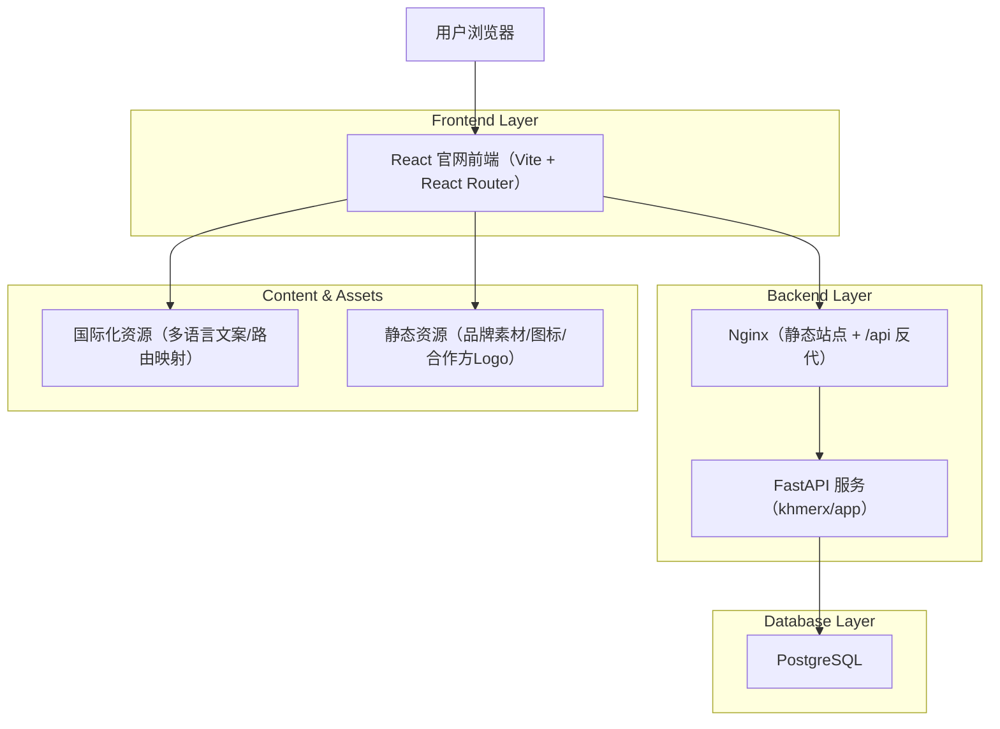
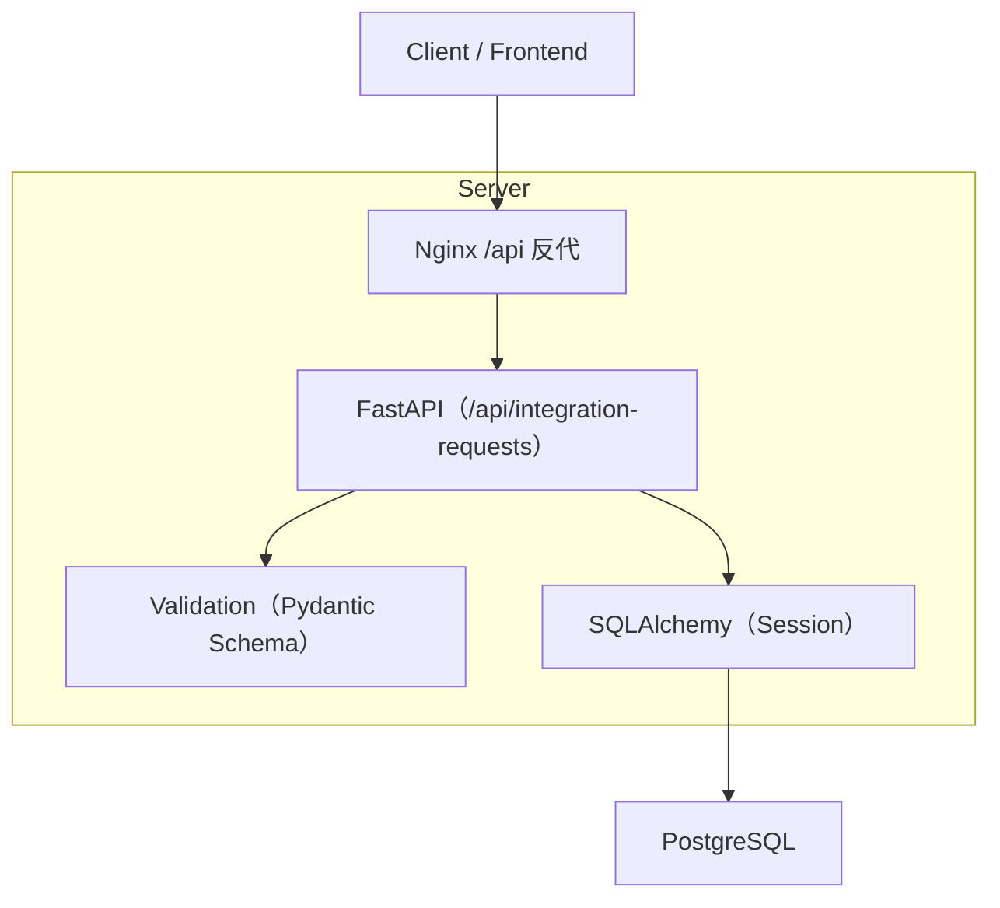
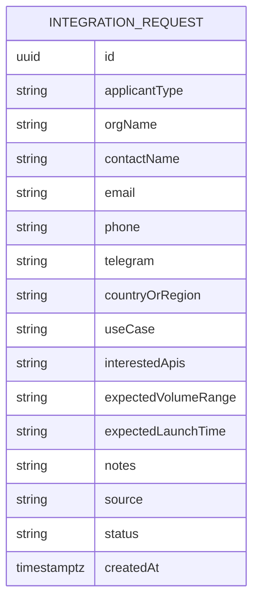

## 1.Architecture design


## 2.Technology Description
- Frontend: React@18 + Vite + React Router + TypeScript
- Styling: tailwindcss@3（统一品牌 Token 与组件样式约束）
- i18n: i18next + react-i18next（多语言文案加载）
- Backend: 复用现有 FastAPI（用于“在线申请接入”表单安全提交、服务端校验与落库）
- Database: PostgreSQL（复用现有 DATABASE_URL 连接配置）
- Analytics: 轻量埋点封装（对接你现有统计方案；若暂无则先统一事件命名与 dataLayer/gtag 适配层）

## 3.Route definitions
采用“语言前缀路由”，保证信息架构对齐、可被搜索引擎正确索引。

| Route | Purpose |
|---|---|
| / | 根路由：根据浏览器语言或默认语言重定向到 /zh（策略可配置） |
| /zh | 中文首页：品牌呈现 + 信任摘要 + 产品入口 + 新增入口（API 文档/在线申请） |
| /en | English 首页 |
| /km | Khmer 首页 |
| /zh/products | 中文产品与解决方案页 |
| /en/products | English 产品与解决方案页 |
| /km/products | Khmer 产品与解决方案页 |
| /zh/trust | 中文信任与关于页 |
| /en/trust | English 信任与关于页 |
| /km/trust | Khmer 信任与关于页 |
| /zh/api | 中文数据接口/API 文档页 |
| /en/api | English 数据接口/API 文档页 |
| /km/api | Khmer 数据接口/API 文档页 |
| /zh/apply | 中文在线申请接入页 |
| /en/apply | English 在线申请接入页 |
| /km/apply | Khmer 在线申请接入页 |

补充约定（实现层面）：
- 语言切换不跳回首页：在同一“页面语义”下切换 locale（如 /zh/api ↔ /en/api），锚点尽量保持一致。
- SEO：静态站点通过预渲染/站点地图（已存在 sitemap.xml）与基础 meta/标题实现。

## 4.API definitions
### 4.1 在线申请接入（表单提交）
```
POST /api/integration-requests
```

Request（JSON）：
| Param Name | Param Type | isRequired | Description |
|---|---|---:|---|
| applicantType | 'company' \| 'individual' | true | 申请类型 |
| orgName | string | true | 机构/团队名称 |
| contactName | string | true | 联系人姓名 |
| email | string | true | 联系邮箱 |
| phone | string | false | 联系电话（与 telegram 二选一） |
| telegram | string | false | Telegram（与 phone 二选一） |
| countryOrRegion | string | false | 国家/地区 |
| useCase | string | true | 业务场景描述 |
| interestedApis | string[] | true | 计划对接接口/数据类型（多选） |
| expectedVolumeRange | string | false | 预计调用量（区间，如 '0-10k/月'） |
| expectedLaunchTime | string | false | 预计上线时间 |
| notes | string | false | 备注 |
| consent | boolean | true | 是否同意隐私/条款 |
| source | string | false | 来源页面（如 '/zh/api#xxx'） |

Response：
| Param Name | Param Type | Description |
|---|---|---|
| ok | boolean | 是否成功 |
| requestId | string | 申请记录 ID |

Example:
```json
{
  "applicantType": "company",
  "orgName": "Example Co.",
  "contactName": "Alice",
  "email": "alice@example.com",
  "telegram": "@alice",
  "useCase": "需要查询风控评分用于授信",
  "interestedApis": ["risk_score", "kyc"],
  "expectedVolumeRange": "10k-100k/月",
  "consent": true,
  "source": "/zh/api#auth"
}
```

实现要点：
- 服务端校验必填与“phone/telegram 二选一”。
- 使用服务端 SQLAlchemy 写入 Postgres（不在前端直连写库），避免暴露写入权限与滥用。

## 5.Server architecture diagram


## 6.Data model(if applicable)
### 6.1 Data model definition


### 6.2 Data Definition Language
Integration Requests（integration_requests）
```
CREATE TABLE integration_requests (
  id UUID PRIMARY KEY DEFAULT gen_random_uuid(),
  applicant_type VARCHAR(20) NOT NULL,
  org_name VARCHAR(200) NOT NULL,
  contact_name VARCHAR(100) NOT NULL,
  email VARCHAR(255) NOT NULL,
  phone VARCHAR(50),
  telegram VARCHAR(100),
  country_or_region VARCHAR(100),
  use_case TEXT NOT NULL,
  interested_apis JSONB NOT NULL,
  expected_volume_range VARCHAR(50),
  expected_launch_time VARCHAR(50),
  notes TEXT,
  source VARCHAR(500),
  status VARCHAR(30) DEFAULT 'new',
  created_at TIMESTAMPTZ DEFAULT NOW()
);

CREATE INDEX idx_integration_requests_created_at ON integration_requests(created_at DESC);
CREATE INDEX idx_integration_requests_status ON integration_requests(status);

部署建议：
- 由 FastAPI 服务持有数据库写权限，前端不直连数据库。
- 若对公网开放提交接口，建议在网关层加限流与基础防刷策略。
```

基础埋点落地建议（实现层）：
- 前端提供统一的 track(eventName, properties) 方法，在 page_view 与关键 CTA/表单节点调用。
- 对于 integration_apply_success，properties 携带 requestId（与后续线索流转关联）。
