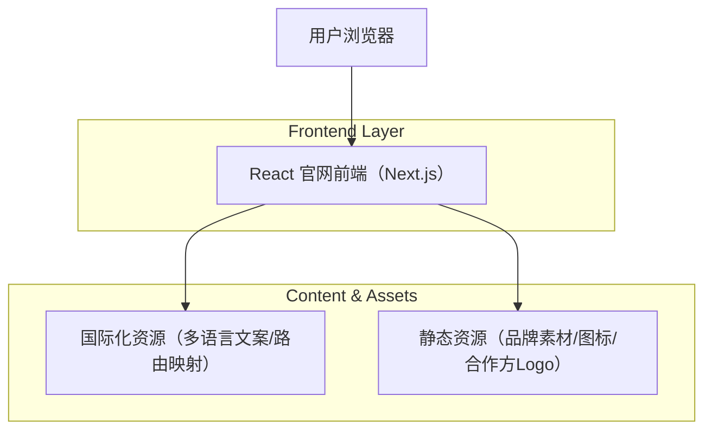

## 1.Architecture design

## 2.Technology Description
- Frontend: React@18 + Next.js@14（App Router，SSR/SSG 兼顾 SEO）+ TypeScript
- Styling: tailwindcss@3（统一品牌 Token 与组件样式约束）
- i18n: next-intl（或同类方案，用于多语言路由与文案加载）
- Backend: None（本次聚焦品牌呈现/信任背书/产品入口/多语言结构，不引入服务端业务）

## 3.Route definitions
采用“语言前缀路由”，保证信息架构对齐、可被搜索引擎正确索引。

| Route | Purpose |
|---|---|
| / | 根路由：根据浏览器语言或默认语言重定向到 /zh（策略可配置） |
| /zh | 中文首页：品牌呈现 + 信任摘要 + 产品入口 |
| /en | English 首页：同信息结构的英文版本 |
| /km | Khmer 首页：同信息结构的高棉语版本 |
| /zh/products | 中文产品与解决方案页：产品矩阵与入口 |
| /en/products | English 产品与解决方案页 |
| /km/products | Khmer 产品与解决方案页 |
| /zh/trust | 中文信任与关于页：背书/合规/FAQ |
| /en/trust | English 信任与关于页 |
| /km/trust | Khmer 信任与关于页 |

补充约定（实现层面）：
- 语言切换不跳回首页：在同一“页面语义”下切换 locale（如 /zh/products ↔ /en/products）。
- SEO：为每个 locale 页面生成对应的 canonical + hreflang（由 Next.js 元数据或 i18n 方案提供）。

## 6.Data model(if applicable)
本次官网形象完善不新增业务数据模型与数据库。
