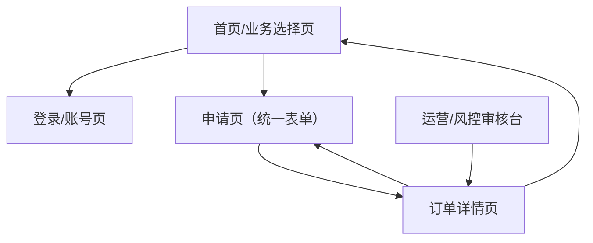

## 1. Product Overview
面向C端用户提供“租机、分期购、手机抵押”三类手机金融/交易服务的一体化申请、签约与履约。
通过统一的申请表单与订单中心，支撑线上提交、风控审核、合同签署、支付/放款与逾期处置。

## 2. Core Features

### 2.1 User Roles
| 角色 | 注册方式 | 核心权限 |
|------|----------|----------|
| C端用户 | 手机号登录（短信验证码）+ 实名/资料提交 | 选择业务、提交申请、签约、支付/还款、查看订单状态 |
| 运营/风控人员 | 后台账号（由管理员创建） | 审核申请、调整关键参数、记录处置动作、导出对账与风控记录 |

### 2.2 Feature Module
本需求最小可用版本包含以下页面：
1. **首页/业务选择页**：三类业务入口、产品要点、费用/示例说明、登录入口。
2. **申请页（统一表单）**：选择业务类型、填写资料、上传材料、提交并生成申请单。
3. **订单详情页**：展示状态、补充材料、签约、支付/放款信息、还款计划与操作入口。
4. **登录/账号页**：手机号登录、退出登录、基础账号信息。
5. **运营/风控审核台**：申请列表、详情核验、审核结论、人工处置记录。

### 2.3 Page Details
| Page Name | Module Name | Feature description |
|-----------|-------------|---------------------|
| 首页/业务选择页 | 业务入口与说明 | 展示“租机/分期购/手机抵押”入口；展示关键条款摘要（押金/租金、分期期数、抵押额度/利率示例）；引导登录与申请 |
| 申请页（统一表单） | 业务类型与报价 | 选择业务类型；按类型展示差异字段（设备/价格/期数/抵押物）；展示费用试算（示例/区间） |
| 申请页（统一表单） | 资料填写与材料上传 | 采集身份信息、联系人、收货/取机地址（如需）；上传身份证/设备信息截图等；校验必填与格式 |
| 申请页（统一表单） | 提交申请 | 创建申请单；锁定关键报价快照；提示预计审核时效；进入订单详情 |
| 订单详情页 | 状态与时间线 | 展示申请→审核→签约→履约→结清/关闭的时间线；展示需补件/需支付/需签约等待办 |
| 订单详情页 | 签约与确认 | 展示合同要点；用户确认条款；记录签署时间与IP/设备指纹（如采集） |
| 订单详情页 | 支付/放款与还款 | 租机：支付首期/押金（如有）；分期购：支付首付（如有）并生成还款计划；抵押：展示放款结果与还款计划 |
| 登录/账号页 | 登录与账号 | 手机号验证码登录；展示实名状态与资料完整度；退出登录 |
| 运营/风控审核台 | 审核与处置 | 列表筛选（业务类型/状态/命中规则）；详情核验材料；给出通过/拒绝/补件；记录审核备注与处置动作 |

## 3. Core Process

### 3.1 C端用户流程（统一）
1) 进入首页选择业务（租机/分期购/手机抵押）→ 2) 登录（如未登录）→ 3) 填写统一申请表（按业务类型展示差异字段）并上传材料 → 4) 提交生成申请单 → 5) 在订单详情查看审核进度；如需补件则补充提交 → 6) 审核通过后在线确认合同要点并签署 → 7) 根据业务类型完成支付/放款 → 8) 在订单详情查看还款计划并按期还款/结清。

### 3.2 运营/风控流程
1) 审核台查看待审列表与命中点 → 2) 核对资料一致性与风险命中 → 3) 输出结论（通过/拒绝/补件）并记录原因 → 4) 通过后进入待签约/待支付监控；逾期时记录催收/处置动作。

### 3.3 页面导航流

## 4. MVP范围（必须有 / 暂不做）
- 必须有：统一申请单；三业务类型差异字段；审核台人工审批；合同要点确认记录；订单状态时间线；还款计划展示（分期/抵押）；基础风控命中记录（规则结果+人工结论）。
- 暂不做（可后续迭代）：自动化授信/评分模型；对接三方KYC/运营商/通讯录；自动扣款；催收外呼系统；更复杂的费用试算（按日计租/提前结清减免等）。

> 详细“核心规则/风控点”“数据字段字典”“三类业务状态机”见同目录补充文档。