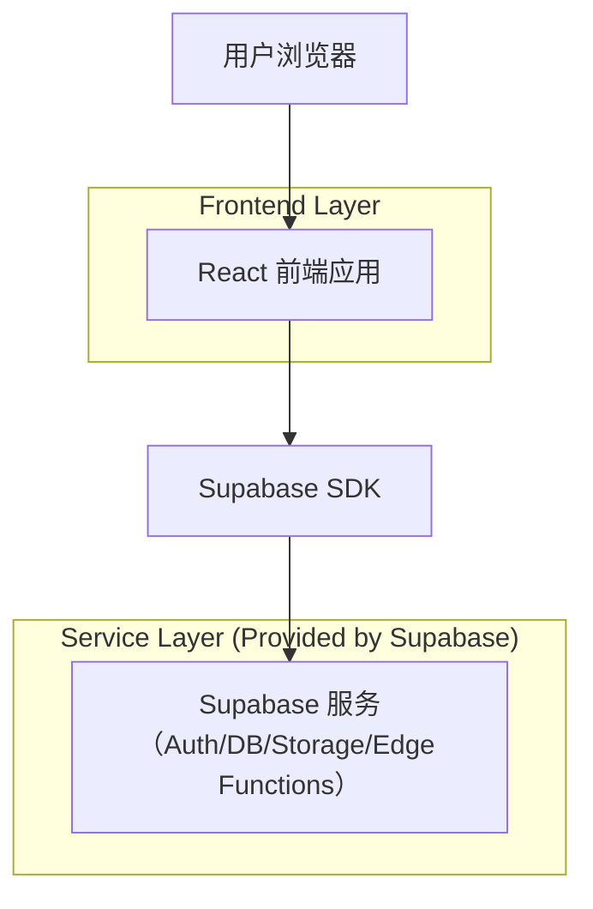
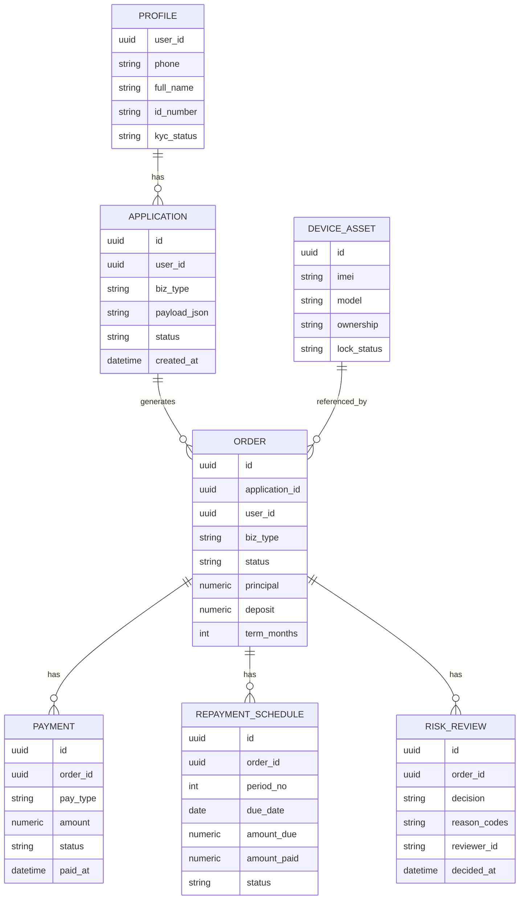

## 1.Architecture design


## 2.Technology Description
- Frontend: React@18 + TypeScript + vite + tailwindcss@3
- Backend: Supabase（Auth + Postgres + Storage + Edge Functions(可选，用于风控规则计算/回调)）

## 3.Route definitions
| Route | Purpose |
|-------|---------|
| / | 首页/业务选择（租机/分期购/手机抵押） |
| /login | 手机号验证码登录/退出 |
| /apply | 统一申请表（根据业务类型切换字段） |
| /orders/:id | 订单详情（状态、补件、签约、支付/放款、还款计划） |
| /admin/reviews | 运营/风控审核台（列表+详情审核） |

## 6.Data model(if applicable)

### 6.1 Data model definition


### 6.2 Data Definition Language
> 说明：为降低早期迭代成本，表间关联采用“逻辑外键”（字段引用）而非物理外键约束。

Profiles（用户扩展信息）
```sql
CREATE TABLE profiles (
  user_id UUID PRIMARY KEY,
  phone VARCHAR(32) NOT NULL,
  full_name VARCHAR(100),
  id_number VARCHAR(64),
  kyc_status VARCHAR(20) DEFAULT 'unverified',
  created_at TIMESTAMPTZ DEFAULT NOW(),
  updated_at TIMESTAMPTZ DEFAULT NOW()
);
GRANT SELECT ON profiles TO anon;
GRANT ALL PRIVILEGES ON profiles TO authenticated;
```

Applications（申请单）
```sql
CREATE TABLE applications (
  id UUID PRIMARY KEY DEFAULT gen_random_uuid(),
  user_id UUID NOT NULL,
  biz_type VARCHAR(20) NOT NULL, -- lease/installment/pledge
  payload_json JSONB NOT NULL,
  status VARCHAR(30) NOT NULL,
  created_at TIMESTAMPTZ DEFAULT NOW(),
  updated_at TIMESTAMPTZ DEFAULT NOW()
);
GRANT SELECT ON applications TO anon;
GRANT ALL PRIVILEGES ON applications TO authenticated;
```

> 更完整字段与枚举值见《租机_分期购_手机抵押_数据字段字典.md》。