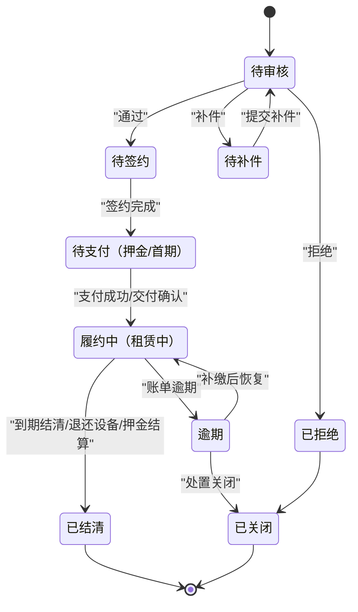
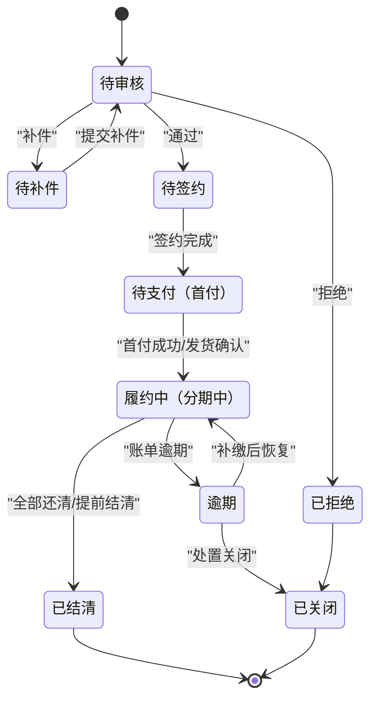
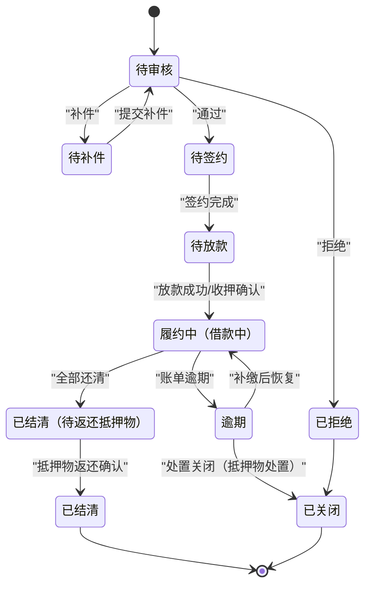

# 三类业务状态机（MVP）

> 说明：状态字段建议统一为 order.status；申请单使用 applications.status（草稿/提交/审核中/补件/拒绝/通过）。

## 1) 租机（lease）订单状态

```mermaid
stateDiagram-v2
  state "待签约" as PENDING_SIGN
  state "待支付（押金/首期）" as PENDING_PAY
  state "履约中（租赁中）" as ACTIVE
  state "逾期" as OVERDUE
  state "已结清" as SETTLED
  state "已关闭" as CLOSED
  state "待审核" as UNDER_REVIEW
  state "待补件" as NEED_MORE_INFO
  state "已拒绝" as REJECTED

  [*] --> UNDER_REVIEW
  UNDER_REVIEW --> NEED_MORE_INFO: "补件"
  NEED_MORE_INFO --> UNDER_REVIEW: "提交补件"
  UNDER_REVIEW --> REJECTED: "拒绝"
  UNDER_REVIEW --> PENDING_SIGN: "通过"
  PENDING_SIGN --> PENDING_PAY: "签约完成"
  PENDING_PAY --> ACTIVE: "支付成功/交付确认"
  ACTIVE --> OVERDUE: "账单逾期"
  OVERDUE --> ACTIVE: "补缴后恢复"
  ACTIVE --> SETTLED: "到期结清/退还设备/押金结算"
  OVERDUE --> CLOSED: "处置关闭"
  REJECTED --> CLOSED
  SETTLED --> [*]
  CLOSED --> [*]
```

## 2) 分期购（installment）订单状态

```mermaid
stateDiagram-v2
  state "待审核" as UNDER_REVIEW
  state "待补件" as NEED_MORE_INFO
  state "已拒绝" as REJECTED
  state "待签约" as PENDING_SIGN
  state "待支付（首付）" as PENDING_PAY
  state "履约中（分期中）" as ACTIVE
  state "逾期" as OVERDUE
  state "已结清" as SETTLED
  state "已关闭" as CLOSED

  [*] --> UNDER_REVIEW
  UNDER_REVIEW --> NEED_MORE_INFO: "补件"
  NEED_MORE_INFO --> UNDER_REVIEW: "提交补件"
  UNDER_REVIEW --> REJECTED: "拒绝"
  UNDER_REVIEW --> PENDING_SIGN: "通过"
  PENDING_SIGN --> PENDING_PAY: "签约完成"
  PENDING_PAY --> ACTIVE: "首付成功/发货确认"
  ACTIVE --> OVERDUE: "账单逾期"
  OVERDUE --> ACTIVE: "补缴后恢复"
  ACTIVE --> SETTLED: "全部还清/提前结清"
  OVERDUE --> CLOSED: "处置关闭"
  REJECTED --> CLOSED
  SETTLED --> [*]
  CLOSED --> [*]
```

## 3) 手机抵押（pledge）订单状态

```mermaid
stateDiagram-v2
  state "待审核" as UNDER_REVIEW
  state "待补件" as NEED_MORE_INFO
  state "已拒绝" as REJECTED
  state "待签约" as PENDING_SIGN
  state "待放款" as PENDING_DISBURSE
  state "履约中（借款中）" as ACTIVE
  state "逾期" as OVERDUE
  state "已结清（待返还抵押物）" as SETTLED_PENDING_RETURN
  state "已结清" as SETTLED
  state "已关闭" as CLOSED

  [*] --> UNDER_REVIEW
  UNDER_REVIEW --> NEED_MORE_INFO: "补件"
  NEED_MORE_INFO --> UNDER_REVIEW: "提交补件"
  UNDER_REVIEW --> REJECTED: "拒绝"
  UNDER_REVIEW --> PENDING_SIGN: "通过"
  PENDING_SIGN --> PENDING_DISBURSE: "签约完成"
  PENDING_DISBURSE --> ACTIVE: "放款成功/收押确认"
  ACTIVE --> OVERDUE: "账单逾期"
  OVERDUE --> ACTIVE: "补缴后恢复"
  ACTIVE --> SETTLED_PENDING_RETURN: "全部还清"
  SETTLED_PENDING_RETURN --> SETTLED: "抵押物返还确认"
  OVERDUE --> CLOSED: "处置关闭（抵押物处置）"
  REJECTED --> CLOSED
  SETTLED --> [*]
  CLOSED --> [*]
```