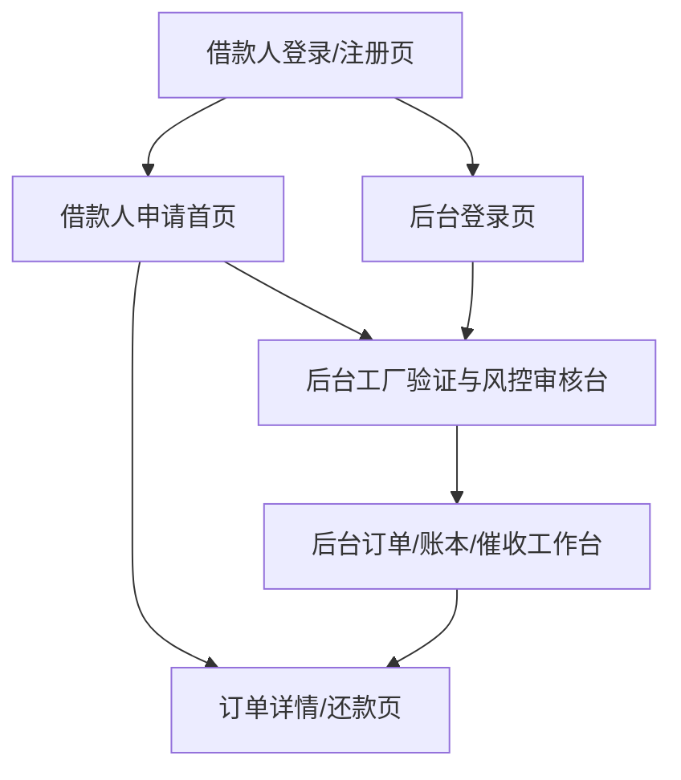

## 1. Product Overview
薪资贷（Salary/Payroll Loan）为“受雇且有稳定工资发放”的用户提供小额、短周期借款，并以雇主（工厂）验证与工资流水作为核心授信依据。
面向借款人 + 内部风控/运营团队 + 雇主验证方，通过可审计账本与标准化催收SOP降低坏账与合规风险。

## 2. Core Features

### 2.1 User Roles
| 角色 | 注册/接入方式 | 核心权限 |
|------|---------------|----------|
| 借款人 | 手机号OTP注册 + KYC | 提交申请、查看额度/费率、签约、查看还款计划、还款/展期（如支持） |
| 雇主验证员（工厂HR） | 邀请链接/白名单账号 | 确认在职/工号/薪资、上传工资单/发薪证明、反馈离职/停发 |
| 风控/运营（Admin） | 后台账号 | 配置产品参数、审核/放款、维护工厂、查看账本、催收分案与跟进 |
| 催收员（可与Admin合并） | 后台账号 | 查看逾期清单、执行外呼/消息、记录承诺还款（PTP）、升级处置 |

### 2.2 Feature Module
产品最小可用版本包含以下页面：
1. **借款人登录/注册页**：手机号OTP、同意合规条款。
2. **借款人申请首页**：额度试算、资料提交、授权与签约入口、申请进度。
3. **订单详情/还款页**：合同摘要、账单/还款计划、还款凭证上传（如线下）。
4. **后台登录页**：账号登录、权限校验。
5. **后台工厂验证与风控审核台**：工厂管理、验证结果、评分与决策、放款操作。
6. **后台订单/账本/催收工作台**：订单查询、账本分录、逾期分案、催收记录与SOP提示。

### 2.3 Page Details
| Page Name | Module Name | Feature description |
|---|---|---|
| 借款人登录/注册页 | OTP登录 + 条款勾选 | 发送/校验OTP；展示并勾选《服务协议》《隐私政策》《征信与数据授权》《催收告知》 |
| 借款人申请首页 | KYC与就业信息 | 采集身份证件、人脸核验结果（可接第三方/人工）；填写雇主/工号/入职时间/发薪方式；上传工资单/银行流水（MVP可选） |
| 借款人申请首页 | 授权与签约 | 收集通讯录/定位/设备信息等授权（按当地法规最小化）；确认费用/APR/还款日；电子签（MVP可用“勾选确认+短信验证码”） |
| 借款人申请首页 | 申请状态 | 展示：待工厂验证/待审核/待签约/已放款/拒绝（含原因类目） |
| 订单详情/还款页 | 账单与还款 | 展示还款计划（期数、应还、逾期费）；支持还款方式指引（转账/代扣/线下）；上传还款凭证并等待核销（MVP） |
| 后台登录页 | 登录与权限 | 登录、角色权限、操作日志入口 |
| 后台工厂验证与风控审核台 | 工厂管理 | 新增/停用工厂；配置工厂评分参数（工资发放周期、最低在职月数、黑名单规则） |
| 后台工厂验证与风控审核台 | 工厂验证队列 | 查看待验证员工列表；触达HR；录入在职/薪资/发薪日/工号校验；上传证明材料；产出“验证通过/不通过/待补充” |
| 后台工厂验证与风控审核台 | 风控评分与决策 | 展示字段与评分；给出建议决策（通过/人工复核/拒绝）；配置额度、期数、费率；审批流转 |
| 后台工厂验证与风控审核台 | 放款与回执 | 录入放款通道信息与回执；生成放款分录；更新订单状态 |
| 后台订单/账本/催收工作台 | 订单查询 | 按用户/工厂/状态/逾期天数检索；导出（权限控制） |
| 后台订单/账本/催收工作台 | 账本查看（可审计） | 按订单查看分录（放款、应收、回款、费用、减免、冲正）；支持对账标记 |
| 后台订单/账本/催收工作台 | 催收分案与跟进 | 逾期自动分案（按DPD/金额/地区）；催收记录（时间、方式、结果、PTP）；升级策略与法务/外包标记 |

## 3. Core Process
### 3.1 借款人主流程
1) 注册登录并勾选合规条款 → 2) 填写KYC与就业信息、提交资料 → 3) 进入“待工厂验证” → 4) 工厂验证通过后进入风控评分/审核 → 5) 审批通过后完成签约 → 6) 放款 → 7) 到期还款/逾期进入催收。

### 3.2 工厂验证（Employer/Factory Verification）
- 目标：确认“真实在职 + 稳定发薪 + 可触达”并形成工厂可信度等级。
- 验证输入：工厂白名单/合同编号（如有）、HR联系方式、员工工号/部门、入职日期、最近N次发薪金额与日期、发薪方式（现金/转账/代发）。
- 核验方式（MVP优先）：
  1) HR后台确认在职与工号；录入/上传工资单或发薪截图。
  2) 运营抽样电话回访（双人复核）；对“高额度/异常”必抽。
  3) 工厂评级：A/B/C（按历史逾期率、配合度、员工离职率）。

### 3.3 风控字段与评分（MVP可规则化）
| 维度 | 核心字段（示例） | 评分/规则要点 |
|---|---|---|
| 身份与反欺诈 | KYC一致性、证件有效期、人脸相似度、设备指纹、定位一致性 | 触发拒绝：证件过期/人脸失败/多设备多号；高风险设备降额 |
| 就业与收入 | 工厂评级、在职月数、工号校验、最近3次发薪金额/波动、发薪日稳定性 | 工厂A加分；在职<3月降额或拒绝；工资波动过大需复核 |
| 行为与申请画像 | 申请时间、提交完整度、资料修改频次、联系人可触达性 | 异常行为（短时多次申请/频繁改资料）触发复核 |
| 历史与负债（如有） | 历史逾期、当前未结清笔数、总负债/收入比 | 逾期历史直接拒绝或强降额；DTI超阈值拒绝 |

**评分输出**：RiskScore 0–100 + 决策：Approve / Manual Review / Reject；并输出建议额度、期数、定价档。

### 3.4 订单/账本映射（Order → Ledger）
- 订单对象：loan_order（申请/审批/放款/结清），还款计划：repayment_schedule（应还与实还）。
- 账本对象：ledger_account（资金/应收/收入/费用/减免），ledger_entry（分录，借贷平衡），与订单ID逻辑关联。

| 订单事件 | 订单状态变化 | 必做账本分录（示例） |
|---|---|---|
| 审批通过并放款成功 | Approved → Disbursed | 借：Loan Receivable（本金应收）/ 贷：Cash（资金） |
| 计提费用/利息（按期或一次性） | Disbursed → Repaying | 借：Interest/Fees Receivable / 贷：Interest/Fees Income |
| 用户还款入账 | Repaying/Overdue | 借：Cash / 贷：Receivable（先费用后利息后本金，可配置） |
| 减免/豁免 | 任意 | 借：Waiver Expense / 贷：Receivable（费用/利息/本金对应科目） |
| 冲正/作废 | 任意 | 生成反向分录，保持可审计（不直接改历史分录） |

### 3.5 催收SOP（Collections SOP）
| 阶段 | DPD范围 | 目标 | 动作（MVP） | 输出与管控 |
|---|---:|---|---|---|
| 预提醒 | D-3 ~ D0 | 提升到期还款 | 短信/WhatsApp提醒；提示还款方式与截止时间 | 触达记录、点击/回复 | 
| 早期 | D1 ~ D7 | 快速回收 | 外呼1–2次/日（限频）；确认原因；生成PTP | 记录原因码、PTP日期金额 | 
| 中期 | D8 ~ D30 | 强化压力与协商 | 外呼+上门（如合规允许）；联系紧急联系人（需授权）；可联系HR确认在职（仅核验，不披露债务细节） | 升级标记、协商方案、减免审批 | 
| 后期 | D31+ | 控制损失 | 分配外包/法务；停止自动展期；评估核销 | 外包交接单、核销清单、留痕审计 |

**催收合规红线（文案与培训要点）**：不威胁、不辱骂、不公开披露债务、不冒充公检法；限制联系频次与时段；仅在已授权范围联系第三方。

### 3.6 MVP阶段拆分
- MVP-0（2–4周）：OTP登录 + 申请/上传资料 + 工厂HR人工验证 + 人工审核放款 + 线下/转账还款凭证核销 + 基础催收记录。
- MVP-1（4–8周）：规则评分自动化 + 自动生成还款计划与计息 + 支付回调自动入账（如接通道）+ 逾期分案与模板化触达 + 报表（放款、回款、逾期）。

### 3.7 合规文案（可直接落地为页面文案）
- 费用与年化提示：展示“本金、利息、服务费、逾期费、总应还、年化（APR）计算口径”，并在签约前二次确认。
- 数据授权：明确列出采集的数据类型、用途、保存期限、共享对象（如KYC/支付/催收外包），提供撤回与删除路径（法律允许范围内）。
- 催收告知：说明可能的提醒方式、联系时段与频次上限、第三方联系规则（需授权）。
- 争议与申诉：提供客服入口、申诉材料清单、处理时效。

