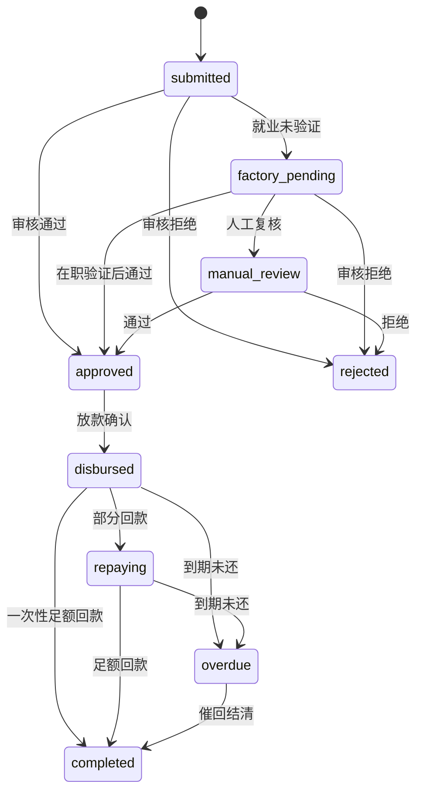
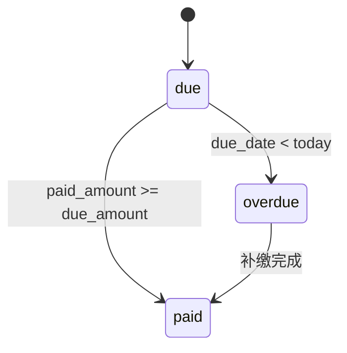
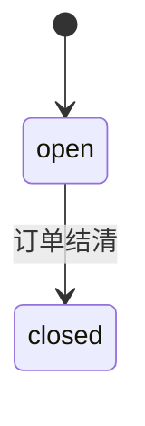
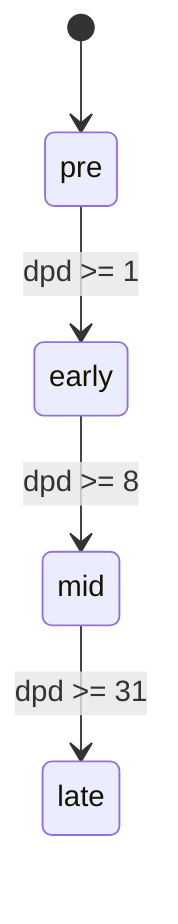
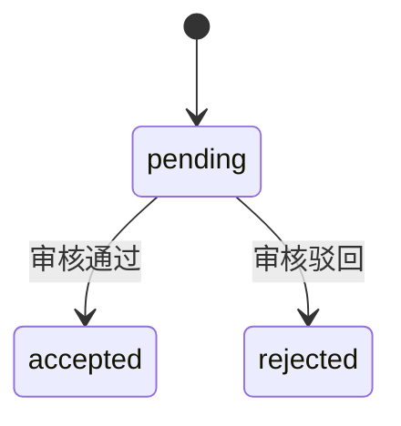
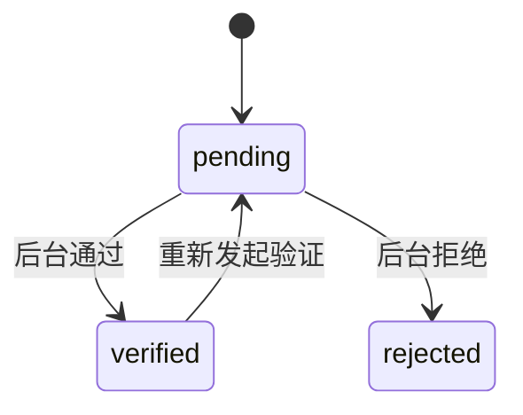

# 薪资贷(Salary-Loan) PRD V2

> 更新时间：2026-06-09  
> 口径说明：本文以当前仓库已实现代码为事实基线，补齐业务闭环、实施优先级与待开发清单。  
> 适用对象：产品负责人、后端、前端、风控、运营、催收、财务对账。

---

## 1. 产品定义

薪资贷是 KhmerX 当前优先级最高的现金流产品。产品面向“有稳定雇主和发薪关系”的用户，依托工厂/企业信息、就业信息、基础认证、回款入账和催收跟进，实现从申请、审核、放款、回款到催收和评级回灌的完整闭环。

### 1.1 目标

- 首推产品：作为 Mini App 首页重点推荐的标准借款产品。
- 现金流导向：优先跑通放款和回款闭环，形成每日可验证现金流。
- 风控导向：以就业真实性、工厂评级、基础认证、历史表现为授信依据。
- 可运营导向：后台可审核、可放款、可核销、可催收、可追账。
- 可迭代导向：先人工审核，后逐步过渡到自动审批和自动催收。

### 1.2 当前代码实现状态

已落地能力：

- Mini App 申请页、订单详情页已实现。
- 用户可提交就业信息、创建薪资贷订单、上传还款凭证。
- Admin 可录入企业信息、验证在职、审核订单、确认放款、审核还款凭证。
- 账本分录已实现：放款、费用计提、利息计提、回款入账。
- 还款回调 Webhook 已实现：签名校验、幂等处理、自动入账。
- 定时任务已实现：薪资贷逾期扫描、工厂评级自动更新。
- 催收案件与催收事件数据模型已就绪，但前端工作台未完成。

未闭环能力：

- Mini App 申请前费用试算展示。
- 用户提交前签约二次确认。
- Admin 催收工作台 UI。
- Admin 账本分录 UI 展示。
- 自动化审批规则表。
- 报表与经营分析面板。

---

## 2. 用户与角色

| 角色 | 当前接入方式 | 核心职责 |
| --- | --- | --- |
| 借款用户 | Telegram Mini App + TMA 登录 + 手机 OTP + 基础资料 | 提交就业信息、申请薪资贷、查看订单、上传还款凭证 |
| 工厂/企业 | 由 Admin 在后台录入 | 提供企业画像，作为就业验证和评级载体 |
| 风控审核员 | Admin JWT 登录 | 在职验证、审批订单、调整费用/利息、拒绝或通过 |
| 放款运营 | Admin JWT 登录 | 放款确认、填写打款参考号、检查到账 |
| 催收人员 | 后台角色复用或后续拆分 | 跟进逾期订单、记录外呼/消息/PTP、推动结清 |
| 财务/对账 | 后台角色复用 | 查看账本、核对入账、处理异常回款 |

---

## 3. 产品范围

### 3.1 本期纳入范围

- 企业录入与评级
- 就业信息录入与验证
- 薪资贷申请、审批、放款
- 单期还款计划
- 凭证还款与 Webhook 回款
- 账本分录与余额冲抵
- 逾期扫描与催收案件生成
- 工厂评级回灌

### 3.2 本期不纳入范围

- 多期分期计划
- 企业端 HR 独立门户
- 自动审批规则引擎配置后台
- 实时支付通道对账报表
- 催收员独立权限体系
- 报表 BI 大屏

---

## 4. 完整状态机定义

> 用户需求写明“5个实体”，但当前实际涉及 6 个实体：订单、还款计划、催收案件、催收阶段、还款凭证、就业验证。V2 按 6 个实体统一定义。

### 4.1 订单状态机 `salary_loan_orders.status`



| 状态 | 当前是否实现 | 进入条件 | 退出条件 |
| --- | --- | --- | --- |
| `submitted` | ✅ | 用户创建订单且就业已验证 | 审核通过/拒绝，或未验证时转 `factory_pending` |
| `factory_pending` | ✅ | 用户创建订单但 `employment.verify_status != verified` | 就业验证后再审批 |
| `manual_review` | 部分 | Admin 可用该状态作为人工复核中间态，当前代码未自动转入 | 审批通过/拒绝 |
| `approved` | ✅ | Admin 决策通过 | 放款确认 |
| `disbursed` | ✅ | Admin 放款确认 | 部分回款、足额回款、逾期 |
| `repaying` | ✅ | 已放款后发生部分回款 | 足额回款或逾期 |
| `overdue` | ✅ | 定时任务扫描到过期未还 | 回款结清 |
| `completed` | ✅ | 单期计划足额还清 | 终态 |
| `rejected` | ✅ | Admin 决策拒绝 | 终态 |

### 4.2 还款计划状态机 `salary_loan_repayment_schedules.status`



| 状态 | 当前是否实现 | 说明 |
| --- | --- | --- |
| `due` | ✅ | 审批通过后生成单期计划 |
| `paid` | ✅ | 入账后 `paid_amount >= due_amount` |
| `overdue` | ✅ | 定时任务 `check_salary_loan_overdue` 设置 |

### 4.3 催收案件状态机 `salary_loan_collection_cases.status`



| 状态 | 当前是否实现 | 说明 |
| --- | --- | --- |
| `open` | ✅ | 逾期后自动 upsert 案件 |
| `closed` | ✅ | 订单结清时自动关闭 |

### 4.4 催收阶段状态机 `salary_loan_collection_cases.stage`



| 阶段 | 当前是否实现 | DPD 规则 | 运营含义 |
| --- | --- | --- | --- |
| `pre` | ✅ | 0 | 预提醒/待到期 |
| `early` | ✅ | 1-7 | 早期催收 |
| `mid` | ✅ | 8-30 | 中期催收 |
| `late` | ✅ | 31+ | 晚期催收/法务前置 |

### 4.5 还款凭证状态机 `salary_loan_repayment_proofs.status`



| 状态 | 当前是否实现 | 说明 |
| --- | --- | --- |
| `pending` | ✅ | 用户上传后进入待审核 |
| `accepted` | ✅ | Admin 审核通过并触发入账 |
| `rejected` | ✅ | Admin 驳回 |

### 4.6 就业验证状态机 `salary_employments.verify_status`



| 状态 | 当前是否实现 | 说明 |
| --- | --- | --- |
| `pending` | ✅ | 用户提交就业信息默认进入 |
| `verified` | ✅ | Admin 一键通过在职验证 |
| `rejected` | ✅ | Admin 驳回就业真实性 |

---

## 5. 业务规则与费率模型

### 5.1 产品参数

当前实现的强规则：

- 借款金额：`30 ~ 5000 USD`
- 期限：`7 / 14 / 30 天`
- 币种：`USD`
- 还款计划：当前仅生成 `1 期`
- 到期日：`today + tenor_days`
- 放款到账：`principal - fee`
- 到期应还：`principal + fee + interest`

### 5.2 当前审批定价规则

当前代码口径中，费用和利息不由前台自动计算，而是在 Admin 审核通过时手工录入：

- `approved_principal`
- `fee`
- `interest`
- `decision_notes`

放款金额规则：

```text
disbursement_amount = max(0, principal - fee)
```

### 5.3 V2 费率模型建议

建议保留“审批可覆盖”机制，同时新增标准化产品参数表：

| 参数 | 说明 | 当前状态 |
| --- | --- | --- |
| `principal_min` | 最低借款金额 | ✅ 代码硬编码 |
| `principal_max` | 最高借款金额 | ✅ 代码硬编码 |
| `allowed_tenors` | 允许期限集合 | ✅ 代码硬编码 |
| `base_fee_rate` | 基础手续费率 | ❌ 待配置化 |
| `base_interest_rate` | 基础利率 | ❌ 待配置化 |
| `risk_pricing_multiplier` | 风险分层系数 | ❌ 待实现 |
| `factory_pricing_adjustment` | 工厂评级调整项 | ❌ 待实现 |
| `repeat_loan_discount` | 复贷优惠 | ❌ 待实现 |

### 5.4 审批定价建议公式

建议在 MVP-1 落地如下试算公式，Admin 仍可改价：

```text
base_fee = principal * fee_rate_by_tenor
base_interest = principal * interest_rate_by_tenor
risk_adj = pricing_by_risk_score(score)
factory_adj = pricing_by_factory_rating(factory_risk_level)
repeat_adj = discount_by_completed_count(completed_count)

final_fee = round(max(0, base_fee + risk_adj.fee + factory_adj.fee - repeat_adj.fee), 2)
final_interest = round(max(0, base_interest + risk_adj.interest + factory_adj.interest - repeat_adj.interest), 2)
```

### 5.5 当前前端缺口

- 用户端未展示费用试算明细。
- 用户端提交前缺少二次签约确认弹窗。
- 用户端未展示到账金额、费用、利息、到期应还的可追溯解释。

---

## 6. 风控评分引擎

### 6.1 已实现评分函数

当前实现函数：`app/salary_loan/router.py::_risk_score`

基础分由 6 个维度组成，总上限 65 分；之后叠加历史表现加分与逾期惩罚。

### 6.2 评分维度与权重

| 维度 | 条件 | 分值 | 命中失败原因 |
| --- | --- | --- | --- |
| 手机验证 | `user.phone_verified_at` | +10 | `phone_unverified` |
| ABA 绑卡 | `user.aba_account` 且 `user.aba_name` | +10 | `aba_missing` |
| 工厂评级 | A/B/C 分别 +15/+10/+5 | 0 到 +15 | `factory_high_risk` / `factory_unknown` |
| 任职时长 | `>=180/+15`, `>=90/+10`, `>=30/+5` | 0 到 +15 | `short_tenure` / `join_date_missing` |
| 发薪周期 | `monthly +10`, `biweekly +5` | 0 到 +10 | `high_risk_pay_cycle` |
| 发薪方式 | `transfer +5` | 0 到 +5 | `cash_pay` |

基础分公式：

```text
score_base = phone + aba + factory + tenure + pay_cycle + pay_method
score_base ∈ [0, 65]
```

### 6.3 历史行为修正

当前已实现附加规则：

- 已结清订单数 `completed_count > 0`
  - 每结清 1 笔 +5 分
  - 封顶 +20 分
- 存在 `dpd >= 7` 且 `status = open` 的催收案件
  - 总分 -20
  - 附加原因：`recent_overdue`

最终公式：

```text
score = clamp(score_base + repeat_bonus - overdue_penalty, 0, 100)
```

### 6.4 当前决策口径

当前实现里，订单初始 `decision = manual_review`，并未根据分值自动 approve/reject。  
也就是说：**风险分已实现，自动决策未实现。**

### 6.5 自动决策建议

建议 MVP-2 增加规则表：

| 分数区间 | 就业验证 | 工厂评级 | 建议决策 |
| --- | --- | --- | --- |
| `>= 70` | 已验证 | A/B | 自动通过 |
| `55 - 69` | 已验证 | A/B/C | 人工审核 |
| `< 55` | 任意 | 任意 | 自动拒绝或人工复核 |

---

## 7. 工厂评级体系

### 7.1 工厂模型现状

当前工厂字段：

- `name`
- `industry`
- `location`
- `owner_type`
- `salary_cycle`
- `worker_count`
- `risk_level`
- `default_rate`
- `hr_contact`
- `is_active`

### 7.2 自动更新逻辑

当前定时任务：`update_salary_factory_ratings`

逻辑口径：

1. 回看最近 60 天订单。
2. 统计某工厂的样本订单数：
   - 仅统计状态在 `disbursed / repaying / overdue / completed` 的订单。
3. 样本量 `< 5` 不更新评级。
4. 统计该工厂下 `dpd >= 7 且 status = open` 的催收案件数。
5. 计算：

```text
ratio = overdue7_open_cases / total_orders
```

评级规则：

- `ratio <= 0.02` -> `A`
- `ratio <= 0.05` -> `B`
- `ratio > 0.05` -> `C`

### 7.3 当前问题

- 无 `D` 级自动落档。
- 评级依据只看“未关闭且 DPD>=7 的案件”，未看历史结案质量。
- 未把离职率、HR 配合度、复贷表现纳入评级。

### 7.4 V2 建议

新增维度：

- 通过率
- 审核拒绝率
- 7+ 逾期率
- 30+ 逾期率
- 离职率
- HR 响应时效
- 复贷表现

---

## 8. 订单 -> 账本映射

### 8.1 科目体系

当前已实现科目：

| 科目 | 含义 |
| --- | --- |
| `cash` | 现金/通道回款/放款资金 |
| `loan_receivable` | 本金应收 |
| `fee_receivable` | 手续费应收 |
| `interest_receivable` | 利息应收 |
| `fee_income` | 手续费收入 |
| `interest_income` | 利息收入 |

### 8.2 六类会计分录规则

> 当前代码的账本事件为 `DISBURSE / ACCRUE / REPAY`，V2 以六类业务规则拆解说明。

| 规则类 | 触发时点 | 借方 | 贷方 | 当前状态 |
| --- | --- | --- | --- | --- |
| 1. 放款本金确认 | 放款时 | `loan_receivable` | `cash` | ✅ |
| 2. 手续费计提 | 放款后 | `fee_receivable` | `fee_income` | ✅ |
| 3. 利息计提 | 放款后 | `interest_receivable` | `interest_income` | ✅ |
| 4. 回款冲抵手续费 | 还款时 | `cash` | `fee_receivable` | ✅ |
| 5. 回款冲抵利息 | 还款时 | `cash` | `interest_receivable` | ✅ |
| 6. 回款冲抵本金 | 还款时 | `cash` | `loan_receivable` | ✅ |

### 8.3 还款冲抵顺序

当前已实现：

```text
fee -> interest -> principal
```

这是系统统一口径，适用于：

- Admin 审核通过凭证
- Webhook 自动回款

### 8.4 当前一致性约束

- 每次入账必须带 `external_ref`
- 相同订单 + `event_type=REPAY` + 相同 `external_ref` 视为重复，直接跳过
- `total_applied <= 0` 则拒绝入账
- 如无还款计划则补建单期计划

### 8.5 待增强

- 增加冲正分录
- 增加退款/退票分录
- 增加减免分录
- 增加坏账核销分录
- 增加按日维度对账视图

---

## 9. 还款回款闭环

### 9.1 当前闭环路径 A：用户上传凭证

1. 用户在订单详情页上传还款凭证
2. 系统创建 `salary_loan_repayment_proofs`
3. Admin 在后台审核凭证
4. 若通过：
   - 更新凭证状态为 `accepted`
   - 调用统一入账函数 `apply_repayment`
   - 更新还款计划、订单状态、催收案件状态

### 9.2 当前闭环路径 B：支付回调 Webhook

1. 支付通道回调 `POST /khmerx/webhooks/salary-loan/repayment`
2. 使用 HMAC 校验：

```text
signature = HMAC_SHA256(secret, "{timestamp}.{raw_body}")
```

3. 校验请求头：
   - `X-KHX-Timestamp`
   - `X-KHX-Signature`
4. 检查时间戳漂移，默认 `300s`
5. 读取 `order_id/payment_id(amount)`
6. 调用统一入账函数 `apply_repayment`
7. 返回：
   - `processed`
   - `skipped`（幂等跳过）

### 9.3 幂等设计

幂等键：

```text
order_id + event_type(REPAY) + external_ref(payment_id/proof_id)
```

重复处理逻辑：

- 已存在同订单、同 `external_ref` 的 `REPAY` 分录 -> 跳过

### 9.4 当前优势

- 线下凭证与线上 Webhook 复用同一套入账逻辑
- 冲抵顺序一致
- 订单状态与还款计划同步更新

### 9.5 当前缺口

- 无自动对账报表
- 无异步重试队列
- 无支付渠道侧状态查询补偿任务
- 无回调验签失败监控与告警

---

## 10. 催收 SOP 与工作台

### 10.1 当前数据基础

已实现数据模型：

- `salary_loan_collection_cases`
- `salary_loan_collection_events`

已实现自动逻辑：

- 逾期后自动 upsert 催收案件
- 根据 DPD 自动切换阶段
- 结清后关闭案件

### 10.2 当前分案逻辑

当前代码未实现“复杂分案引擎”，仅自动创建案件，`assignee` 仍为空。  
V2 建议按以下逻辑分案：

| 条件 | 分案建议 |
| --- | --- |
| DPD 1-7 | 客服提醒池 |
| DPD 8-30 | 催收员池 |
| DPD 31+ | 高风险池/主管池 |
| 工厂评级 C 且金额高 | 优先分给资深催收 |

### 10.3 四阶段催收策略

| 阶段 | DPD | 策略 | 当前状态 |
| --- | --- | --- | --- |
| `pre` | 0 | 到期前提醒、引导主动还款 | ✅ 数据阶段已实现，前台策略未完成 |
| `early` | 1-7 | WhatsApp/短信/电话首催 | ✅ 阶段已实现，工作台未实现 |
| `mid` | 8-30 | 高频跟进、要求 PTP、联系紧急联系人/HR | 部分，仅数据模型 |
| `late` | 31+ | 上门/法务前置/委外 | 部分，仅数据模型 |

### 10.4 跟进记录

事件字段已支持：

- `channel`
- `result`
- `reason_code`
- `note`
- `ptp_date`
- `ptp_amount`
- `actor`

### 10.5 催收工作台 PRD 要求

P1 必做：

- 案件列表
- DPD/阶段/金额/工厂筛选
- 案件详情抽屉
- 跟进记录时间线
- 新建跟进记录
- PTP 记录和失约标记

P2 建议：

- 自动分案
- 催收员业绩看板
- 话术模板
- 渠道送达/接通统计

---

## 11. 自动化定时任务

### 11.1 已实现任务

| 任务 | 周期 | 作用 |
| --- | --- | --- |
| `check_lender_payment_timeout` | 5 分钟 | P2P 产品放款超时取消 |
| `check_repayment_overdue` | 30 分钟 | P2P 产品逾期扫描 |
| `check_salary_loan_overdue` | 30 分钟 | 薪资贷逾期扫描、生成催收案件、发送逾期提醒 |
| `generate_repayment_due_reminders` | 30 分钟 | P2P 到期前提醒 |
| `auto_unblock_users` | 10 分钟 | 风控自动解封 |
| `generate_daily_risk_summary` | 每日 23:55 | 风险日报 |
| `update_salary_factory_ratings` | 每日 23:50 | 薪资贷工厂评级更新 |
| `push_pending_risk_events_to_openclaw` | 1 分钟 | 推送待处理风险事件 |

### 11.2 建议新增任务

| 任务 | 优先级 | 作用 |
| --- | --- | --- |
| `salary_loan_due_reminder_24h` | P1 | 薪资贷到期前 24h 提醒 |
| `salary_loan_webhook_reconcile` | P1 | 回调与内部账本差异补偿 |
| `salary_loan_collection_assign` | P1 | 自动分案 |
| `salary_loan_ptp_breach_check` | P1 | PTP 失约检测 |
| `salary_loan_daily_cashbook` | P2 | 每日放款/回款/余额日报 |
| `salary_loan_factory_health_summary` | P2 | 工厂逾期、结清、拒绝率日报 |

---

## 12. 完整 API 定义

### 12.1 口径说明

按历史 PRD 口径，当前“核心业务 API”已实现 13 个。  
若计入新增工厂编辑接口和还款 Webhook，则当前实际已落地 15 个接口。

### 12.2 已实现 13 个核心业务 API

#### 用户侧 API（5）

| 接口 | 方法 | 说明 |
| --- | --- | --- |
| `/api/v1/salary-loan/factories` | GET | 获取可申请工厂列表 |
| `/api/v1/salary-loan/employment` | POST | 提交就业信息 |
| `/api/v1/salary-loan/orders` | POST | 创建薪资贷订单 |
| `/api/v1/salary-loan/orders/{order_id}` | GET | 获取订单详情 |
| `/api/v1/salary-loan/orders/{order_id}/repayment-proof` | POST | 上传还款凭证 |

#### Admin 核心 API（8）

| 接口 | 方法 | 说明 |
| --- | --- | --- |
| `/api/admin/salary-loan/factories` | GET | 查询工厂列表 |
| `/api/admin/salary-loan/factories` | POST | 新增工厂 |
| `/api/admin/salary-loan/employments/{employment_id}/verify` | POST | 就业验证 |
| `/api/admin/salary-loan/orders` | GET | 订单列表 |
| `/api/admin/salary-loan/orders/{order_id}` | GET | 订单详情，含就业/工厂/凭证/计划/账本/催收 |
| `/api/admin/salary-loan/orders/{order_id}/decision` | POST | 审批通过/拒绝 |
| `/api/admin/salary-loan/orders/{order_id}/disburse` | POST | 放款确认 |
| `/api/admin/salary-loan/proofs/{proof_id}/review` | POST | 还款凭证审核 |

### 12.3 新增已落地增强接口（2）

| 接口 | 方法 | 说明 |
| --- | --- | --- |
| `/api/admin/salary-loan/factories/{factory_id}` | PATCH | 编辑企业/工厂信息 |
| `/khmerx/webhooks/salary-loan/repayment` | POST | 支付渠道回款通知 |

### 12.4 待实现 11 个 API

| 接口 | 方法 | 说明 | 优先级 |
| --- | --- | --- | --- |
| `/api/v1/salary-loan/calculate` | POST | 用户端费用试算 | P1 |
| `/api/v1/salary-loan/orders/{id}/confirm` | POST | 用户二次确认签约 | P1 |
| `/api/v1/salary-loan/orders/{id}/aba-guide` | GET | 获取 ABA 转账指引 | P2 |
| `/api/admin/salary-loan/collections` | GET | 催收案件列表 | P1 |
| `/api/admin/salary-loan/collections/{id}` | GET | 催收案件详情 | P1 |
| `/api/admin/salary-loan/collections/{id}/events` | GET | 查询跟进记录 | P1 |
| `/api/admin/salary-loan/collections/{id}/events` | POST | 新增催收跟进 | P1 |
| `/api/admin/salary-loan/orders/{id}/ledger` | GET | 账本分录详情 | P1 |
| `/api/admin/salary-loan/orders/{id}/waive` | POST | 减免/优惠/手工调整 | P2 |
| `/api/admin/salary-loan/rules/auto-decision` | GET/PUT | 自动审批规则配置 | P2 |
| `/api/admin/salary-loan/reports/overview` | GET | 经营总览报表 | P2 |

---

## 13. 页面与组件要求

详细页面定义见《薪资贷(Salary-Loan)_页面设计.md》。  
本节仅保留产品关键要求：

- 用户端必须展示：
  - 企业选择
  - 就业信息
  - 借款金额/期限
  - 费用试算
  - 二次确认
  - 订单状态和还款计划
  - 还款凭证上传
- Admin 端必须展示：
  - 工厂库
  - 订单审核列表
  - 订单抽屉详情
  - 账本分录区域
  - 催收信息区域
  - 催收工作台

---

## 14. 数据模型

### 14.1 已落地实体

| 实体 | 表名 | 说明 |
| --- | --- | --- |
| 工厂 | `salary_factories` | 企业信息与评级 |
| 就业 | `salary_employments` | 用户就业信息与验证状态 |
| 订单 | `salary_loan_orders` | 核心借款订单 |
| 还款计划 | `salary_loan_repayment_schedules` | 单期还款计划 |
| 账本 | `salary_loan_ledger_entries` | 分录级账务流水 |
| 凭证 | `salary_loan_repayment_proofs` | 用户上传凭证 |
| 催收案件 | `salary_loan_collection_cases` | 逾期案件 |
| 催收事件 | `salary_loan_collection_events` | 跟进记录/PTP |

### 14.2 关键关系

```text
factory 1 - n employment
employment 1 - n order
order 1 - n schedule
order 1 - n ledger_entry
order 1 - n proof
order 1 - 0..1 collection_case
collection_case 1 - n collection_event
```

---

## 15. 实施路径

### 15.1 V0（已完成）

- 用户申请闭环：工厂列表 -> 就业信息 -> 创建订单
- Admin 审核闭环：在职验证 -> 审批 -> 放款
- 订单详情与单期还款计划
- 用户上传还款凭证
- Admin 审核凭证并统一入账
- Webhook 自动回款
- 账本分录与冲抵顺序
- 逾期扫描与工厂评级自动更新

### 15.2 MVP-1（推荐优先实施）

目标：解决“能运营、能回款、能看清”的问题。

P1 模块：

1. 催收工作台前端
2. 账本分录 UI
3. 用户端费用试算展示
4. 用户提交前签约二次确认

### 15.3 MVP-2

目标：解决“能规模化、能自动化”的问题。

- ABA 转账指引
- 自动分案
- PTP 跟踪
- 自动审批规则配置
- 经营报表
- Webhook 对账任务

### 15.4 V2 规划

目标：解决“能提效、能复制、能扩张”的问题。

- 企业端 HR 协作入口
- 多期还款计划
- 减免/冲正/坏账核销
- 全量自动审批
- 催收员独立工作台与绩效面板
- 工厂健康度评分体系

---

## 16. 当前差距总结表

| 模块 | 当前状态 | 差距 | 推荐优先级 |
| --- | --- | --- | --- |
| 催收工作台前端 | 数据模型已就绪 | 缺 UI、缺录入事件能力 | P1 |
| 账本分录 UI | 后端已返回数据 | 前端未展示 | P1 |
| 费用试算展示 | 仅 Admin 手填 | 用户侧看不到成本明细 | P1 |
| 签约二次确认 | 未实现 | 用户提交前缺费用确认 | P1 |
| ABA 转账指引 | 未实现 | 订单页缺收款说明 | P2 |
| 自动风控决策 | 仅计算分数 | 无自动 approve/reject | P2 |
| 对账补偿 | 未实现 | 回款异常难追踪 | P2 |
| 报表中心 | 未实现 | 无经营视图 | P2 |

---

## 17. 配置变量

| 变量 | 用途 |
| --- | --- |
| `DATABASE_URL` | 数据库连接 |
| `UPLOAD_DIR` | 还款凭证本地存储目录 |
| `UPLOAD_BASE_URL` | 凭证访问基础域名 |
| `DEV_TMA_ENABLED` | 开发环境 Telegram 登录调试 |
| `OTP_DEV_MODE` | 开发环境 OTP 调试 |
| `ADMIN_USERNAME` | 后台用户名 |
| `ADMIN_PASSWORD` | 后台密码 |
| `ADMIN_JWT_SECRET` | 后台 JWT 密钥 |
| `SALARY_LOAN_WEBHOOK_SECRET` | 薪资贷回款回调密钥 |
| `SALARY_LOAN_WEBHOOK_MAX_SKEW_SECONDS` | 回调签名最大时间漂移 |
| `SCHEDULER_ENABLED` | 是否启用定时任务 |

---

## 18. 参考文档

- `app/salary_loan/router.py`
- `app/salary_loan/admin_router.py`
- `app/services/salary_loan_payments.py`
- `app/routes/webhooks.py`
- `app/scheduler/jobs.py`
- `frontend/miniapp/src/pages/SalaryLoanApply.tsx`
- `frontend/miniapp/src/pages/SalaryLoanOrderDetail.tsx`
- `frontend/risk-admin/src/pages/SalaryLoan.tsx`
- `tests/test_salary_loan_user_flow.py`
- `tests/test_salary_loan_admin_flow.py`
- `tests/test_salary_loan_repayment_webhook.py`

### 3.2 还款计划(SalaryLoanRepaymentSchedule) 状态

```
due → overdue → paid
  ↘ paid (直接还清)
```

| 状态 | 含义 | 触发 |
|------|------|------|
| `due` | 待还款 | 审核放款时创建 |
| `overdue` | 已逾期 | 到期日未还(定时任务) |
| `paid` | 已还清 | 还款入账>=应还 |

### 3.3 催收案件(SalaryLoanCollectionCase) 状态

```
open → closed
```

| 状态 | 含义 | 触发 |
|------|------|------|
| `open` | 催收中 | 逾期发生时创建/更新 |
| `closed` | 已结案 | 订单completed后自动关闭 |

### 3.4 催收阶段(stage) 定义

| 阶段 | DPD范围 | 目标 |
|------|---------|------|
| `pre` | D-3~D0 | 预提醒, 提示还款 |
| `early` | D1~D7 | 快速回收, 日外呼1-2次 |
| `mid` | D8~D30 | 强化催收, 可联系紧急联系人 |
| `late` | D31+ | 外包/法务, 评估核销 |

### 3.5 还款凭证(SalaryLoanRepaymentProof) 状态

```
pending → accepted / rejected
```

### 3.6 就业验证(SalaryEmployment) 状态

```
pending → verified / rejected
```

---

## 4. Feature Modules

### 4.1 产品最小可用版本(V0/MVP-0)包含页面

| 页面 | 模块 | 功能描述 | 实施状态 |
|------|------|----------|----------|
| 借款人登录/注册页 | OTP登录+条款勾选 | 发送/校验OTP；展示并勾选合规条款 | ✅ 已有 |
| 借款人申请首页 | KYC与就业信息 | 工厂选择、工号/入职日期、发薪信息 | ✅ 已有 |
| 借款人申请首页 | 额度试算 | 输入金额/期限后展示费用(后端计算) | ⚠️ 基础版,可增强 |
| 借款人申请首页 | 提交申请 | POST /salary-loan/orders | ✅ 已有 |
| 订单详情/还款页 | 订单摘要与还款计划 | 展示状态/金额/还款计划 | ✅ 已有 |
| 订单详情/还款页 | 上传还款凭证 | 支持图片上传+金额+备注 | ✅ 已有 |
| 后台登录页 | 账号登录+权限校验 | JWT认证 | ✅ 已有 |
| 后台工厂管理 | 新增/编辑/停用工厂 | 全字段CRUD | ✅ 已有 |
| 后台订单审核 | 订单列表+状态筛选 | 按状态过滤,列表展示 | ✅ 已有 |
| 后台订单抽屉 | 在职验证→审核→放款→核销| 单页完成全流程操作 | ✅ 已有 |
| 后台还款凭证审核 | 审核通过/驳回 | 通过后自动入账 | ✅ 已有 |

### 4.2 待补充/增强的模块(MVP-1)

| 页面 | 模块 | 功能描述 | 建议优先级 |
|------|------|----------|------------|
| 借款人申请首页 | 费用试算可视化 | 展示APR/本金/费用/到账/应还明细 | P1 |
| 借款人申请首页 | 签约流程 | 勾选确认+二次确认弹窗 | P1 |
| 借款人申请首页 | 申请状态追踪 | 待工厂验证/审核中/已放款等Badge | P1 |
| 订单详情/还款页 | ABA转账信息引导 | 展示收款账号/转账指引 | P1 |
| 订单详情/还款页 | 还款方式扩展 | 支付通道回调自动入账 | P2 |
| 后台订单/账本 | 账本分录查看 | 按订单查看完整分录时间线 | P1 |
| 后台催收工作台 | 逾期案件列表+分案 | 按DPD/金额排序,分配催收员 | P1 |
| 后台催收工作台 | 催收跟进记录 | 记录外呼/消息/PTP | P1 |
| 后台催收工作台 | SOP引导面板 | 按DPD自动展示建议动作 | P2 |
| 后台报表 | 放款/回款/逾期统计 | 日/周/月维度 | P2 |

---

## 5. 业务规则与费率模型

### 5.1 产品参数配置

| 参数 | 默认值 | 可配置范围 | 说明 |
|------|--------|------------|------|
| 最小借款金额 | $30 | $10-$100 | 低于此值不可提交 |
| 最大借款金额 | $5,000 | $100-$10,000 | 受风控评分动态调整 |
| 期限选项 | 7/14/30天 | 7/14/21/30天 | MVP只含7/14/30 |
| 新用户最大额度 | $200 | $50-$500 | 首次申请上限 |
| 费用率(fee) | 本金×5% | 0%-15% | 审批时人工/规则制定 |
| 利率(interest) | 本金×3% | 0%-10% | 按期限浮动 |
| 逾期费率 | 应还×1%/天 | 0.5%-2% | 不超过本金50%上限 |
| 发薪日对齐 | 可选 | ON/OFF | 还款日是否对齐发薪日 |

### 5.2 费用计算模型

**费用构成**
- `disbursement_amount = principal - fee`（实际到账 = 本金 - 费用）
- `total_due = principal + fee + interest`（到期应还）

**示例**
- 借款 $100, 14天: fee=$5, interest=$3 → 到账$95, 到期还$108

**费用归属**
- fee → 平台服务费（会计分录: fee_receivable ↔ fee_income）
- interest → 利息收入（会计分录: interest_receivable ↔ interest_income）

### 5.3 审批定价规则

审核员/系统在审批时决定:
- `approved_principal`: 批准金额（可低于申请金额）
- `fee`: 费用金额
- `interest`: 利息金额

规则建议:
- 工厂A级: fee ≤ 5%, interest ≤ 3%
- 工厂B级: fee ≤ 8%, interest ≤ 5%
- 工厂C级: fee ≤ 12%, interest ≤ 8%

---

## 6. 风控评分与决策引擎

### 6.1 评分维度与规则（V0规则引擎已实现）

| 维度 | 核心字段 | 评分/规则要点 | 权重(当前实现) |
|------|---------|---------------|----------------|
| 身份与反欺诈 | 手机号验证状态、ABA绑定性 | phone_verified +10, aba_missing - | 最高+20 |
| 工厂可信度 | 工厂评级(A/B/C) | A+15, B+10, C+5 | 最高+15 |
| 就业稳定性 | 在职月数,发薪周期 | ≥6个月+15, ≥3个月+10, ≥1个月+5 | 最高+15 |
| 发薪方式 | 转账/现金 | transfer +5 | 最高+5 |
| 历史表现 | 完成订单数 | completed>0: +min(20, 5/count) | 最高+20 |
| 逾期记录 | 逾期≥7天的催收案件 | 存在: -20 | 负扣分 |

**评分输出**: RiskScore 0–100 (当前代码实现 `_risk_score` 函数)

**决策规则**

| 条件 | 决策 |
|------|------|
| 就业验证未通过 | status=factory_pending（等待验证） |
| 工厂已验证 + 分数>=60 | decision=approved（绕过手动审核） |
| 工厂已验证 + 分数<60 | decision=manual_review（规则化） |
| 当前实现 | decision固定为manual_review（待自动化） |

### 6.2 MVP-1 增强规划

- **自动化规则决策**：配置风险规则表，自动输出 Approve/Manual Review/Reject
- **反欺诈增强**：设备指纹、IP一致性、GPS定位验证
- **DTI计算**：月还款/月工资 ≤ 50%
- **多头借贷检测**：同一借款人活跃订单数限制

---

## 7. 工厂管理评级体系

### 7.1 工厂数据模型字段

| 字段 | 类型 | 说明 |
|------|------|------|
| name | string | 工厂名称 |
| industry | string | 行业类别(factory/garment/electronic/other) |
| location | string | 地点(PP/SV/KP等) |
| owner_type | enum | unknown/private/state/foreign |
| salary_cycle | enum | monthly/biweekly/weekly/unknown |
| worker_count | int | 工人数(用于规模评估) |
| risk_level | enum A/B/C | 风险等级 |
| default_rate | decimal | 历史违约率 |
| hr_contact | string | HR联系方式 |
| is_active | bool | 是否启用 |

### 7.2 工厂评级自动更新（已实现）

由定时任务 `update_salary_factory_ratings` 每天UTC 23:50自动执行：

```
评级 条件(近60天)
A   逾期≥7天占比 ≤ 2%
B   逾期≥7天占比 2%-5%
C   逾期≥7天占比 > 5%
```

- 数据不足(总订单<5): 跳过更新
- 运营也可手动调整risk_level

### 7.3 工厂管理后台操作

| 操作 | 说明 |
|------|------|
| 新增工厂 | 填写全字段信息后保存 |
| 编辑工厂 | 修改任意字段 |
| 启用/停用 | is_active开关 |
| 查看订单 | 按工厂筛选关联订单 |

---

## 8. 订单→账本映射（可审计账本）

### 8.1 科目体系

| 科目(account) | 类型 | 说明 |
|---------------|------|------|
| cash | 资金 | 资金账户 |
| loan_receivable | 应收-本金 | 本金应收 |
| fee_receivable | 应收-费用 | 费用应收 |
| interest_receivable | 应收-利息 | 利息应收 |
| fee_income | 收入-费用 | 费用收入 |
| interest_income | 收入-利息 | 利息收入 |

### 8.2 会计分录规则

| 事件(event_type) | 借方 | 贷方 | 触发时机 |
|------------------|------|------|----------|
| DISBURSE（放款） | loan_receivable (principal) | cash (principal) | 放款确认 |
| ACCRUE（计费） | fee_receivable (fee) | fee_income (fee) | 放款确认时 |
| ACCRUE（计息） | interest_receivable (interest) | interest_income (interest) | 放款确认时 |
| REPAY（还款） | cash (还款金额) | fee→interest→principal 依次冲抵 | 凭证审核通过/Webhook |
| partial REPAY | cash (部分金额) | 按 fee→interest→principal 顺序 | 部分还款 |
| WAIVE（减免） | 减免科目 | receivable冲抵 | 运营操作 |
| REVERSE（冲正） | 反向分录 | 反向分录 | 更正错误(不直接修改历史) |

### 8.3 还款冲抵顺序（已实现）

当一笔还款入账时，按以下顺序冲抵：
1. 先冲 fee_receivable（费用应收）
2. 再冲 interest_receivable（利息应收）
3. 最后冲 loan_receivable（本金应收）

### 8.4 幂等设计

```
唯一约束: (order_id, event_type, external_ref, account)
```
- `external_ref` = payment_id（支付通道回调时使用）
- `external_ref` = proof_id（凭证核销时使用）
- 重复请求返回 `{status: "skipped"}`

---

## 9. 还款回款闭环

### 9.1 还款方式

| 方式 | MVP | 说明 |
|------|-----|------|
| 线下转账+上传凭证 | ✅ V0 | 用户转账后上传截图,运营审核入账 |
| 支付通道Webhook | ✅ V0 | 外部支付系统回调自动入账(已实现) |
| 自动代扣 | ❌ V2 | 绑定ABA自动扣款 |

### 9.2 凭证核销流程

```
用户上传凭证(pending)
     ↓ (运营在后台审核)
accepted ──→ apply_repayment() ──→ 更新账本+还款计划+订单状态
rejected ──→ 退回,用户可重新上传
```

### 9.3 Webhook 回调（已实现）

**接口**: `POST /khmerx/webhooks/salary-loan/repayment`

**安全机制**:
- HMAC-SHA256 签名校验 (`X-KHX-Timestamp` + `X-KHX-Signature`)
- 时间戳防重放(默认300s窗口)
- 幂等校验(by external_ref)

**请求体**:
```json
{
  "event": "repayment.paid",
  "order_id": "uuid",
  "payment_id": "pay_001",
  "amount": 108.0
}
```

### 9.4 还款后订单状态变化

```
disbursed → repaying（部分还款）
disbursed → completed（全额还清）
repaying → repaying（部分还款）
repaying → completed（全额还清）
overdue → repaying（逾期后部分还款）
overdue → completed（逾期后全额还清）
```

---

## 10. 催收SOP与工作台

### 10.1 催收分案逻辑（已实现定时任务）

`check_salary_loan_overdue` 定时任务(每30分钟):

```
扫描所有逾期未还的 repayment_schedule
  → 计算 DPD = today - due_date
  → 更新 stage:
     D1-D7  → early
     D8-D30 → mid
     D31+   → late
  → 创建或更新 SalaryLoanCollectionCase
  → 生成 App 内通知(如用户未关闭提醒)
```

### 10.2 催收阶段SOP

| 阶段 | DPD | 目标 | 动作 | 输出 |
|------|-----|------|------|------|
| pre | D-3~D0 | 预防逾期 | App提醒; WhatsApp/短信提醒 | 触达记录 |
| early | D1-D7 | 快速回收 | 外呼1-2次/日; 确认原因; 生成PTP | 原因码, PTP日期金额 |
| mid | D8-D30 | 强化催收 | 外呼+上门(合规); 联系紧急联系人(需授权) | 升级标记, 协商方案 |
| late | D31+ | 控制损失 | 外包/法务; 评估核销 | 盘点交接单, 核销清单 |

### 10.3 催收后台工作台（需实现）

**催收案件列表**
- 筛选: DPD范围/阶段/催收员/订单金额
- 排序: DPD降序/金额降序/最后跟进时间
- 操作: 分配催收员/查看详情/记录跟进

**催收跟进记录表单**
- 联系渠道: call / whatsapp / sms /上门
- 结果: contacted / not_reachable / ptp / promise_broken / dispute
- 原因码: no_answer / wrong_number / will_pay / need_time / financial_difficulty
- PTP: 承诺还款日期 + 金额
- 下次跟进时间

**SOP引导面板**
- 根据当前DPD自动展示建议话术和合规提醒
- 红色警示: 不威胁/不辱骂/不冒充公检法/限频次时段

### 10.4 催收事件记录（数据模型已实现）

```python
SalaryLoanCollectionEvent:
  case_id      # 关联催收案件
  channel      # call / whatsapp / sms /上门
  result       # contacted / ptp / etc.
  reason_code  # no_answer / will_pay / etc.
  note         # 备注
  ptp_date     # 承诺还款日期
  ptp_amount   # 承诺还款金额
  actor        # 执行人
```

---

## 11. 自动化定时任务

### 11.1 现有任务

| 任务 | 周期 | 说明 | 状态 |
|------|------|------|------|
| check_salary_loan_overdue | 每30分钟 | 扫描逾期还款计划并创建催收案件 | ✅ |
| update_salary_factory_ratings | 每天23:50 | 基于历史逾期率更新工厂评级 | ✅ |

### 11.2 建议新增任务

| 任务 | 周期 | 说明 | 优先级 |
|------|------|------|--------|
| 到期前提醒 | 每天 | 扫描D-3到D0的订单,生成App通知 | P1 |
| 逾期每日计费 | 每天 | 按逾期费率每天计算罚息(目前仅标记) | P2 |
| 逾期升级 | 每天 | D30自动标记为严重逾期,生成外包清单 | P1 |
| 自动核销 | 每月 | 逾期超90天的订单自动评估核销 | P3 |

---

## 12. 页面详细设计

### 12.1 借款人登录/注册页（/salary-loan/login）

| 组件 | 说明 | 状态 |
|------|------|------|
| Logo+品牌说明 | 产品一句话说明 | ⚠️ 需设计 |
| 手机号输入 | 含国家码+86/855 | ✅ 已有(通用OTP) |
| OTP发送/校验 | 倒计时,频控 | ✅ 已有 |
| 条款勾选(4项) | 服务协议/隐私政策/数据授权/催收告知 | ⚠️ 需补充 |
| 登录/继续按钮 | 校验后跳转申请页 | ✅ 已有 |

### 12.2 借款人申请首页（/salary-loan/apply）

| 组件 | 说明 | 状态 |
|------|------|------|
| 工厂选择 | 搜索+下拉,仅显示active工厂 | ✅ 已有 |
| 就业信息 | 工号/入职日期/部门 | ✅ 已有 |
| 发薪信息 | 发薪周期/方式/金额/发薪日 | ✅ 已有 |
| 借款金额输入 | 步进+输入,30-5000 | ✅ 已有 |
| 期限选择 | 7/14/30天 | ✅ 已有 |
| 费用试算展示 | 本金/费用/到账/应还 | ⚠️ 需加入 |
| 提交按钮 | 二次确认后提交 | ✅ 已有 |
| 申请状态Badge | 当前进度显示 | ❌ 待实现 |

### 12.3 订单详情/还款页（/salary-loan/order/:id）

| 组件 | 说明 | 状态 |
|------|------|------|
| 订单摘要 | 状态/本金/应还/到期日 | ✅ 已有 |
| 工厂信息 | 工厂名/工号 | ✅ 已有 |
| 还款计划 | 期数/应还/已还/状态 | ✅ 已有 |
| 还款区 | 金额/备注/文件上传 | ✅ 已有 |
| 缴款指引 | ABA账号/转账说明 | ❌ 待实现 |

### 12.4 运营后台

#### 12.4.1 工厂管理（/salary-loan → factories tab）

| 组件 | 说明 | 状态 |
|------|------|------|
| 新增工厂表单 | 全字段输入 | ✅ 已有 |
| 工厂列表 | 表格展示所有字段 | ✅ 已有 |
| 编辑工厂抽屉 | 修改任意字段 | ✅ 已有 |

#### 12.4.2 订单审核（/salary-loan → orders tab）

| 组件 | 说明 | 状态 |
|------|------|------|
| 订单列表 | 筛选状态+分页 | ✅ 已有 |
| 订单抽屉 | 摘要+就业+决策+放款+凭证审核 | ✅ 已有 |
| 风控评分展示 | RiskScore+原因码 | ⚠️ 需增强字段展示 |
| 账本分录查看 | 放款/计费/入账时间线 | ❌ 待实现 |

#### 12.4.3 催收工作台（待实现）

| 组件 | 说明 | 优先 |
|------|------|------|
| 逾期案件列表 | DPD/金额/阶段/催收员/最后跟进 | P1 |
| 催收跟进表单 | 渠道/结果/原因码/PTP | P1 |
| SOP面板 | 按DPD展示建议 | P2 |
| 分案操作 | 分配催收员 | P2 |

---

## 13. API定义

### 13.1 Mini App（用户端）- 已实现

| 方法 | 路径 | 说明 | 状态 |
|------|------|------|------|
| GET | /api/v1/salary-loan/factories | 查询可用工厂列表 | ✅ |
| POST | /api/v1/salary-loan/employment | 创建就业信息 | ✅ |
| POST | /api/v1/salary-loan/orders | 创建订单 | ✅ |
| GET | /api/v1/salary-loan/orders/{order_id} | 订单详情(含工厂/还款计划) | ✅ |
| POST | /api/v1/salary-loan/orders/{order_id}/repayment-proof | 上传还款凭证 | ✅ |

### 13.2 运营后台-已实现

| 方法 | 路径 | 说明 | 状态 |
|------|------|------|------|
| POST | /api/admin/login | 管理员登录 | ✅ |
| GET | /api/admin/salary-loan/factories | 工厂列表 | ✅ |
| POST | /api/admin/salary-loan/factories | 新增工厂 | ✅ |
| PATCH | /api/admin/salary-loan/factories/{id} | 编辑工厂 | ✅ |
| POST | /api/admin/salary-loan/employments/{id}/verify | 在职验证 | ✅ |
| GET | /api/admin/salary-loan/orders | 订单列表(按状态筛选) | ✅ |
| GET | /api/admin/salary-loan/orders/{id} | 订单详情(含就业/工厂/凭证/账本/催收) | ✅ |
| POST | /api/admin/salary-loan/orders/{id}/decision | 审核决策(approve/reject) | ✅ |
| POST | /api/admin/salary-loan/orders/{id}/disburse | 放款确认 | ✅ |
| POST | /api/admin/salary-loan/proofs/{id}/review | 凭证审核(accepted/rejected) | ✅ |

### 13.3 Webhook-已实现

| 方法 | 路径 | 说明 | HMAC签名 | 幂等 |
|------|------|------|----------|------|
| POST | /khmerx/webhooks/salary-loan/repayment | 还款回调入账 | ✅ | ✅(external_ref) |

### 13.4 待实现API

| 方法 | 路径 | 说明 | 优先级 |
|------|------|------|--------|
| GET | /api/v1/salary-loan/orders | 用户订单列表 | P1 |
| GET | /api/v1/salary-loan/calculate | 额度费用试算 | P1 |
| GET | /api/admin/salary-loan/orders/{id}/ledger | 账本分录明细 | P1 |
| GET | /api/admin/salary-loan/collections | 催收案件列表 | P1 |
| POST | /api/admin/salary-loan/collections/{id}/assign | 分配催收员 | P1 |
| POST | /api/admin/salary-loan/collections/{id}/events | 添加催收跟进记录 | P1 |
| GET | /api/admin/salary-loan/statistics | 放款/回款/逾期统计 | P2 |
| POST | /api/admin/salary-loan/orders/{id}/waive | 费用减免 | P2 |
| POST | /api/admin/salary-loan/orders/{id}/reverse | 冲正 | P2 |

---

## 14. 数据模型

### 14.1 实体关系图

```
USERS ||--o{ SALARY_EMPLOYMENT : works
SALARY_FACTORY ||--o{ SALARY_EMPLOYMENT : employs
SALARY_EMPLOYMENT ||--o{ SALARY_LOAN_ORDER : applies
SALARY_LOAN_ORDER ||--o{ SALARY_LOAN_REPAYMENT_SCHEDULE : has
SALARY_LOAN_ORDER ||--o{ SALARY_LOAN_LEDGER_ENTRY : posts
SALARY_LOAN_ORDER ||--o{ SALARY_LOAN_REPAYMENT_PROOF : uploads
SALARY_LOAN_ORDER ||--o{ SALARY_LOAN_COLLECTION_CASE : tracks
SALARY_LOAN_COLLECTION_CASE ||--o{ SALARY_LOAN_COLLECTION_EVENT : logs
```

### 14.2 各表核心字段

详见已有数据定义(DDL)，各模型已在 `app/models/salary_*.py` 中完整实现。

**主要差异说明：**
- 当前实现比原始PRD多出: `SalaryLoanRepaymentProof`(还款凭证), `SalaryLoanCollectionEvent`(催收事件), `SalaryFactory`扩展字段(industry/location/owner_type/worker_count/salary_cycle)
- 当前实现缺少: 统一的Ledger Account表(当前直接用account字符串)

---

## 15. 实施路径与阶段拆分

### 15.1 V0/MVP-0（已完成）

**目标**: 全流程跑通, 人工运营为主

| 模块 | 实施情况 |
|------|----------|
| OTP登录+资料完善 | ✅ 已有 |
| 工厂管理(CRUD) | ✅ 已有 |
| 就业信息提交 | ✅ 已有 |
| 订单创建+状态流转 | ✅ 已有 |
| 人工审核(在职验证→决策→放款) | ✅ 已有 |
| 凭证上传+人工核销入账 | ✅ 已有 |
| 还款Webhook自动入账 | ✅ 已有 |
| 逾期自动扫描催收 | ✅ 已有 |
| 账本分录(放款/计费/还款) | ✅ 已有 |
| 工厂评级自动更新 | ✅ 已有 |

**E2E验收脚本**: 见 `E2E_验收脚本.md` ✅

### 15.2 MVP-1（阶段二，推荐优先实施）

**目标**: 减少人工介入，增加自动化

| 模块 | 说明 | 工作量估计 |
|------|------|------------|
| 自动化风控决策 | 配置规则表,自动approve低风险 | 3-5天 |
| 费用试算接口 | GET /calculate 返回费用明细 | 1-2天 |
| 签约二次确认 | 前端弹窗确认费用+条款 | 1-2天 |
| 还款计划预生成 | 放款时生成完整分期计划(已有) | ✅ |
| 催收工作台 | 案件列表+跟进记录 | 5-7天 |
| 账本分录UI | 订单抽屉内展示账本时间线 | 2-3天 |
| App内还款提醒 | 到期前D-3提醒 | 2-3天(依赖通知模块) |
| 基础报表 | 放款/回款/逾期统计 | 3-5天 |

### 15.3 MVP-2（阶段三）

| 模块 | 说明 |
|------|------|
| 多期还款 | 支持2-4期分期还款 |
| FPD(首期逾期)预警 | 首期即逾期自动标记高风控 |
| 催收策略配置 | DPD阈值/频次/渠道可配置 |
| 运营看板 | 实时数据仪表盘 |

---

## 16. MVP-1+ 与 V2 规划

### 16.1 费率与产品灵活性

- **差异化定价**: 基于工厂评级+个人评分动态生成fee/interest
- **灵活期限**: 7-30天可选,按天计息
- **会员体系**: 按时还款积累信用,获得更好费率

### 16.2 支付通道集成

- **ABA Payment Gateway**: 支付回调直接入账(当前webhook已预留接口)
- **Wing/TrueMoney**: 扩展支付渠道
- **自动代扣**: 绑定ABA账号后自动扣款

### 16.3 催收智能化

- **智能分案**: 按DPD/金额/地区/催收员技能自动分配
- **催收策略引擎**: 可配置催收频次/话术/升级规则
- **AI辅助外呼**: 自动拨打+语音识别+摘要生成

### 16.4 借款人体验增强

- **额度试算器**: 滑动选择金额/期限,实时计算
- **订单追踪**: 可视化进度条,预计时效
- **还款日历**: 集成Google Calendar/本地日历
- **多语言**: 高棉语/英语/中文(已有i18n框架)

### 16.5 合规与安全

- **完整审计日志**: 所有后台操作写入admin_audit_log(已有框架)
- **数据导出**: 借款记录/还款记录CSV导出
- **申诉入口**: 用户可对拒绝/逾期标记发起申诉
- **KYC增强**: 身份证OCR+人脸比对

---

## 附录A：当前代码与PRD差距总结

| 领域 | PRD要求 | 当前实现 | 差距 |
|------|---------|----------|------|
| 借款人登录页 | OTP+4项条款勾选 | OTP已实现,条款勾选待补充 | 小 |
| 费用试算展示 | 额度试算+费用明细 | 无前端展示 | ⚠️ 需补充 |
| 签约二次确认 | 弹窗确认 | 无 | ⚠️ 需补充 |
| 申请状态追踪 | 待验证/审核中/已放款等 | 无Badge组件 | 小 |
| ABA转账指引 | 收款账号展示 | 无 | ⚠️ 需补充 |
| 账本分录查看 | 分录时间线 | 后端已返回,前端未展示 | 中 |
| 催收工作台 | 案件列表/跟进/SOP | 后端有数据模型,前端无页面 | **大** |
| 催收SOP引导 | 按DPD建议动作 | 无 | 中 |
| 报表 | 放款/回款/逾期统计 | 无 | 中 |
| 多期还款 | 2-4期分期 | 当前仅1期 | V2 |
| 支付通道集成 | ABA自动回调 | webhook已预留 | MVP-1 |
| 反欺诈增强 | 设备指纹/GPS | 无 | V2 |

## 附录B：已实现的自动化任务配置

| 环境变量 | 默认值 | 说明 |
|----------|--------|------|
| SCHEDULER_ENABLED | true | 是否启用定时任务 |
| SALARY_LOAN_WEBHOOK_SECRET | "" | Webhook HMAC密钥 |
| SALARY_LOAN_WEBHOOK_MAX_SKEW_SECONDS | 300 | Webhook时间戳允许偏差 |
| ADVANCE_PAY_HOURS | 24 | 放款超时时间(用于P2P) |
| OVERDUE_DAYS_LIMIT | 7 | 逾期升级阈值(P2P) |

## 附录C：参考文档

| 文档 | 路径 |
|------|------|
| 技术架构 | 薪资贷(Salary-Loan)_技术架构.md |
| 页面设计 | 薪资贷(Salary-Loan)_页面设计.md |
| E2E验收脚本 | E2E_验收脚本.md |
| 全产品PRD | KhmerX_全产品_PRD.md |
| Credit OS PRD | KhmerX_Credit_OS_PRD.md |
| 风控平台PRD | 风控平台管理后台_PRD.md |
