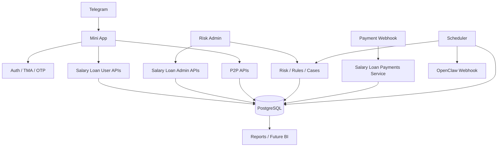
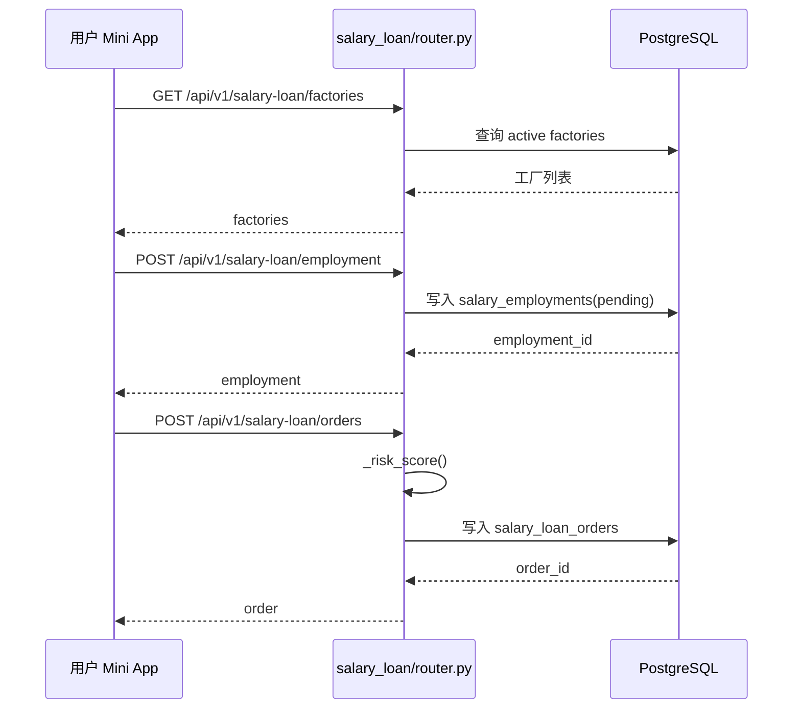
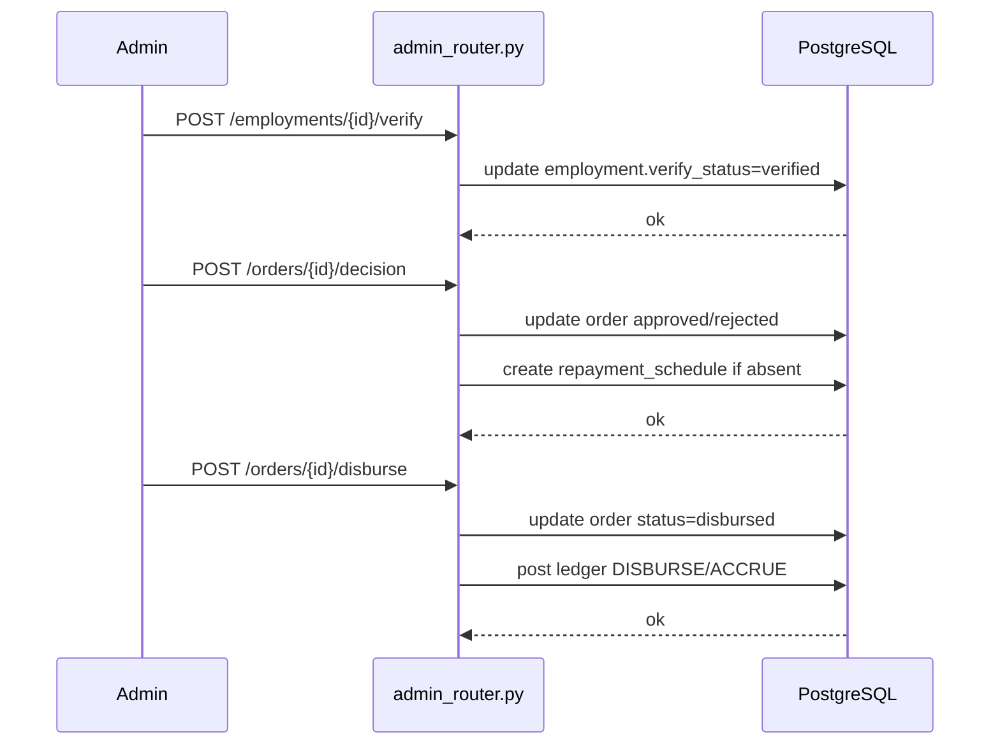
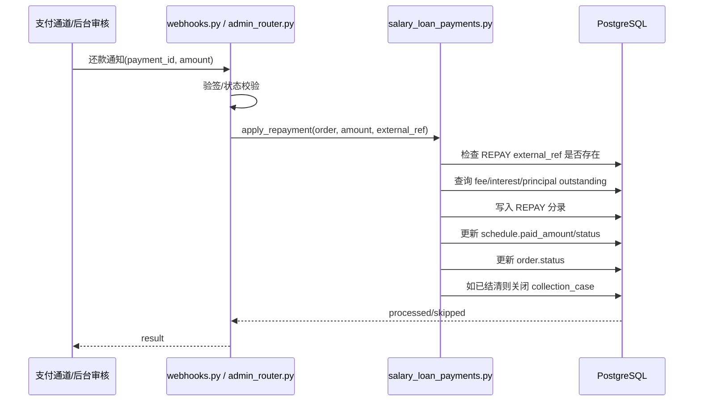
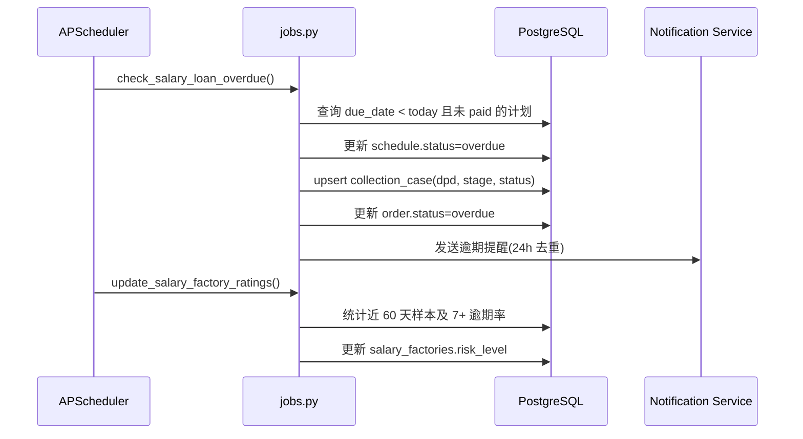
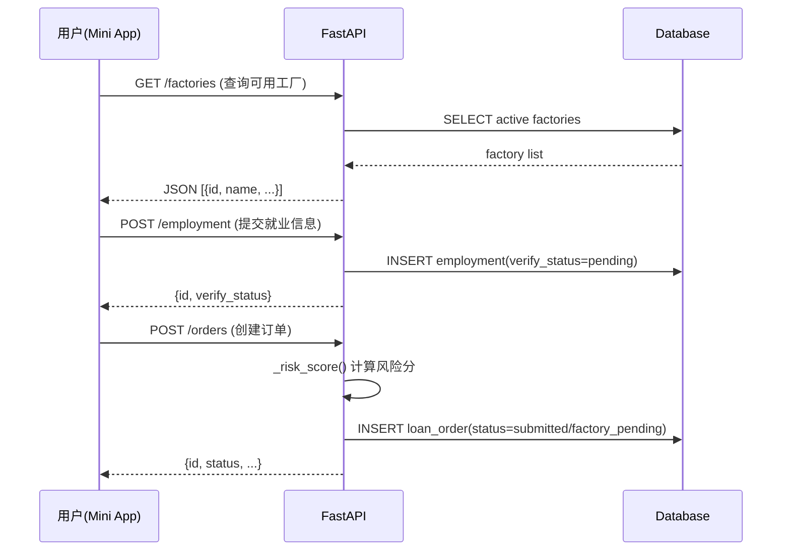
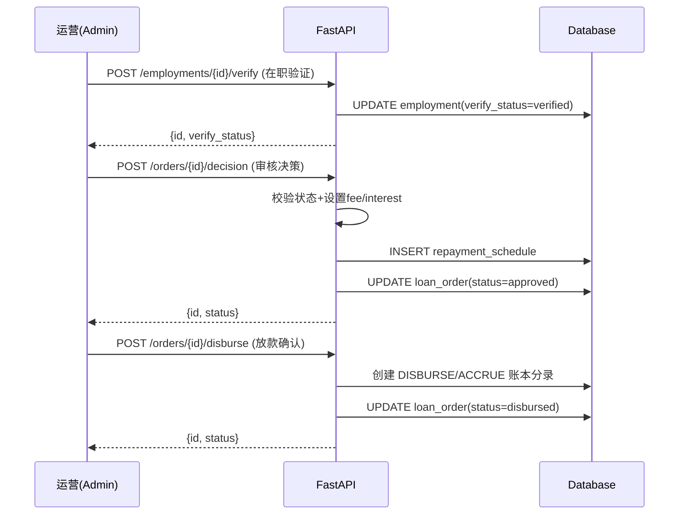
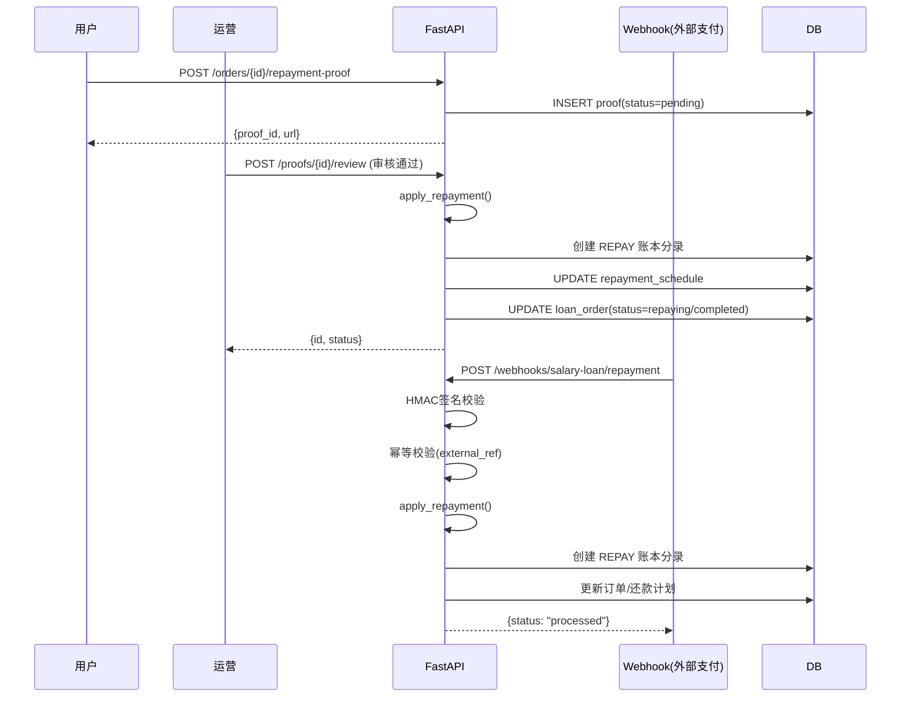
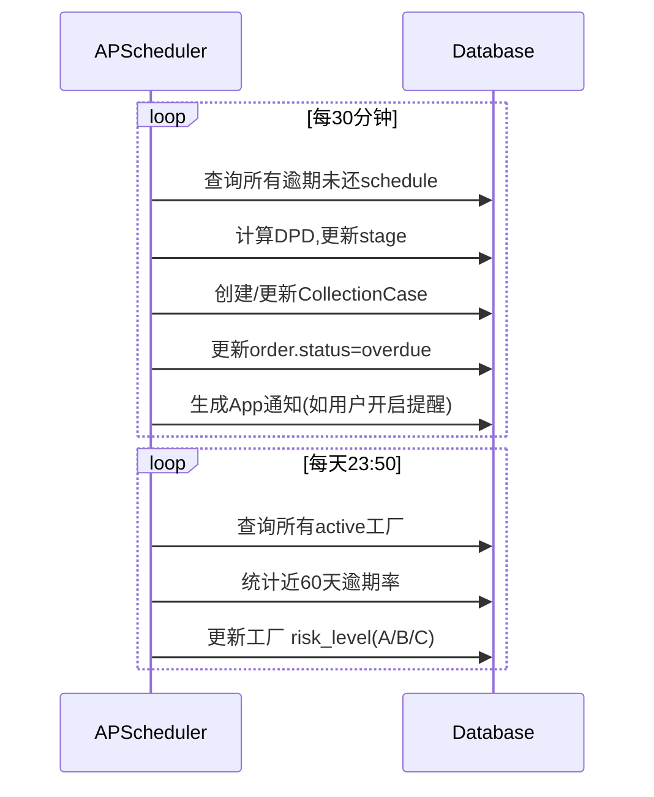
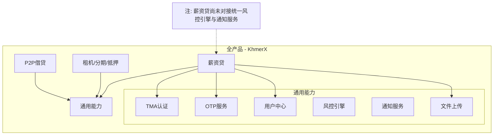

# 薪资贷(Salary-Loan) 技术架构 V2

> 更新时间：2026-06-09  
> 口径说明：本文以当前仓库实际代码为准，补齐模块结构、时序图、算法、一致性矩阵、与全产品关系。

---

## 1. 架构目标

薪资贷技术架构围绕 4 个关键词设计：

- 可申请：Mini App 低阻力接入，支持 Telegram TMA 登录。
- 可审核：Admin 可查看订单、就业、工厂、凭证、账本、催收信息。
- 可入账：所有回款进入统一的复式账本逻辑。
- 可运营：定时任务自动发现逾期、更新工厂评级，并为催收工作台预留数据基础。

---

## 2. 技术栈

| 层 | 技术 | 当前用途 |
| --- | --- | --- |
| 用户端前端 | React 18 + TypeScript + Vite + Tailwind | Mini App 申请与订单详情 |
| 运营后台前端 | React 18 + TypeScript + Vite + Tailwind | 薪资贷审核后台 |
| 后端 | FastAPI | 用户 API、Admin API、Webhook |
| ORM | SQLAlchemy 2.x | 数据模型与持久化 |
| 数据库 | PostgreSQL / SQLite | 生产/本地测试 |
| 任务调度 | APScheduler BackgroundScheduler | 逾期、评级、提醒 |
| 用户认证 | Telegram Mini App TMA + OTP | 用户登录与资料校验 |
| 后台认证 | JWT | Admin 登录 |
| 签名算法 | HMAC-SHA256 | 薪资贷回款 Webhook 验签 |

---

## 3. 与全产品架构的关系



说明：

- 薪资贷不是独立站点，而是嵌在 KhmerX 全产品中的一个业务域。
- 用户认证、通知、文件上传、调度框架均复用全产品基础设施。
- 风控事件和 OpenClaw 推送也与全产品共用。

---

## 4. 完整模块结构图

```text
app/
├── main.py
├── config.py
├── database.py
├── api_v1/
│   ├── auth.py
│   ├── errors.py
│   ├── responses.py
│   ├── router.py
│   └── schemas.py
├── admin/
│   ├── auth.py
│   └── router.py
├── routes/
│   ├── auth.py
│   ├── webhooks.py
│   ├── tg_webhook.py
│   └── ...
├── salary_loan/
│   ├── __init__.py
│   ├── router.py
│   ├── admin_router.py
│   ├── schemas.py
│   ├── service.py
│   └── models.py
├── services/
│   ├── salary_loan_payments.py
│   ├── webhook_hmac.py
│   ├── notifications.py
│   ├── otp.py
│   └── openclaw_webhook.py
├── scheduler/
│   ├── __init__.py
│   ├── jobs.py
│   └── runner.py
├── models/
│   ├── user.py
│   ├── notification.py
│   ├── salary_factory.py
│   ├── salary_employment.py
│   ├── salary_loan_order.py
│   ├── salary_loan_repayment.py
│   ├── repayment_schedule.py
│   └── ...
├── risk/
│   ├── engine.py
│   ├── service.py
│   ├── models.py
│   └── schemas.py
└── ops/
    ├── models.py
    ├── router.py
    └── service.py

frontend/
├── miniapp/
│   └── src/
│       ├── App.tsx
│       ├── api/
│       │   ├── client.ts
│       │   ├── types.ts
│       │   └── v1.ts
│       ├── components/
│       │   ├── AppShell.tsx
│       │   ├── TabBar.tsx
│       │   └── ui/
│       └── pages/
│           ├── SalaryLoanApply.tsx
│           ├── SalaryLoanOrderDetail.tsx
│           ├── ProfileSetup.tsx
│           └── ...
└── risk-admin/
    └── src/
        ├── App.tsx
        ├── api/http.ts
        ├── components/
        │   ├── Drawer.tsx
        │   └── salaryLoan/
        │       ├── FactoriesPanel.tsx
        │       ├── OrdersPanel.tsx
        │       ├── OrderDrawer.tsx
        │       └── types.ts
        └── pages/
            └── SalaryLoan.tsx

tests/
├── test_salary_loan_user_flow.py
├── test_salary_loan_admin_flow.py
└── test_salary_loan_repayment_webhook.py
```

---

## 5. 分层职责

### 5.1 用户侧接口层 `app/salary_loan/router.py`

职责：

- 查询可申请工厂
- 创建就业信息
- 创建订单
- 查询订单详情
- 上传还款凭证
- 计算风险分

特点：

- 使用 `get_current_user_tma`
- 创建订单时做 profile 完整性校验
- 与 Admin 审核、放款解耦

### 5.2 管理端接口层 `app/salary_loan/admin_router.py`

职责：

- 工厂 CRUD（当前新增/查询/编辑已实现）
- 就业验证
- 订单列表与详情
- 审批
- 放款
- 凭证审核

特点：

- 使用 `get_current_admin`
- 订单详情整合就业、工厂、凭证、计划、账本、催收信息

### 5.3 支付服务层 `app/services/salary_loan_payments.py`

职责：

- 账本余额查询
- 回款幂等判断
- 冲抵顺序计算
- 写入分录
- 更新还款计划与订单状态
- 关闭催收案件

特点：

- 凭证审核和 Webhook 都复用这一层

### 5.4 Webhook 接入层 `app/routes/webhooks.py`

职责：

- 读取原始 body
- 做签名校验
- 解析回调参数
- 查找订单
- 调用统一入账服务

### 5.5 调度层 `app/scheduler/jobs.py`

职责：

- 薪资贷逾期扫描
- 工厂评级更新
- 全产品通知与风控任务复用

---

## 6. 核心数据流

### 6.1 用户申请时序图



### 6.2 后台审核时序图



### 6.3 还款入账时序图



### 6.4 定时任务时序图



---

## 7. 核心算法详解

### 7.1 风险评分算法

实现位置：`app/salary_loan/router.py::_risk_score`

```text
phone_verified    +10
aba_bound         +10
factory_risk      +15/+10/+5/0
tenure_days       +15/+10/+5/0
pay_cycle         +10/+5/0
pay_method        +5/0
repeat_loan_bonus +0~20
recent_overdue    -20
```

特征说明：

- 它是“规则打分”，不是机器学习模型。
- 当前仅用于生成 `risk_score` 和 `decision_notes`。
- 尚未与自动审批联动。

### 7.2 还款冲抵算法

实现位置：`app/services/salary_loan_payments.py::apply_repayment`

步骤：

1. 校验 `amount > 0`
2. 校验 `external_ref` 非空
3. 判断同订单同 `external_ref` 是否已存在 `REPAY` 分录
4. 计算三类应收余额：
   - `fee_receivable`
   - `interest_receivable`
   - `loan_receivable`
5. 依顺序冲抵：

```text
remaining -> fee -> interest -> principal
```

6. 写入 `cash` 借方和各类应收贷方
7. 更新单期计划 `paid_amount`
8. 若计划已足额支付：
   - `schedule.status = paid`
   - `order.status = completed`
   - 如存在催收案件则 `case.status = closed`
9. 若仅部分支付：
   - `order.status = repaying`

### 7.3 工厂评级算法

实现位置：`app/scheduler/jobs.py::update_salary_factory_ratings`

```text
since = now - 60 days
total = 近60天内有效样本订单数
if total < 5: skip
overdue7 = 该工厂 open 且 dpd >= 7 的案件数
ratio = overdue7 / total
ratio <= 0.02 -> A
ratio <= 0.05 -> B
else -> C
```

---

## 8. 幂等与一致性保障矩阵

| 场景 | 风险 | 当前保障 | 缺口 |
| --- | --- | --- | --- |
| 重复 Webhook | 重复入账 | `external_ref` 幂等跳过 | 无持久化 webhook log |
| 凭证重复审核 | 重复核销 | proof 仅允许 `pending` 审核 | 无审计比对报表 |
| 放款重复点击 | 重复放款分录 | 依赖订单状态 `approved -> disbursed` | 无按钮级防抖/幂等键 |
| 逾期任务重复跑 | 重复创建催收案 | upsert case by order_id first() | 无唯一索引 |
| 工厂评级重复更新 | 覆盖同值 | 定时任务幂等覆盖 | 无评级变更历史表 |
| 订单详情聚合 | 跨表不一致 | 同事务内提交，详情实时查询 | 无快照表 |

### 8.1 推荐补强

- 为 `salary_loan_collection_cases.order_id` 增唯一约束
- 新增 `salary_loan_webhook_logs`
- 新增 `salary_loan_factory_rating_logs`
- 放款接口增加 `idempotency_key`
- 关键更新前加乐观锁或状态版本号

---

## 9. 路由注册关系

### 9.1 用户 API

- 路由前缀：`/api/v1/salary-loan`
- 注册文件：`app/salary_loan/router.py`
- 鉴权：`get_current_user_tma`

### 9.2 Admin API

- 路由前缀：`/api/admin/salary-loan`
- 注册文件：`app/salary_loan/admin_router.py`
- 鉴权：`get_current_admin`

### 9.3 Webhook API

- 路由前缀：`/khmerx/webhooks`
- 注册文件：`app/routes/webhooks.py`

---

## 10. 前后端交互关系

### 10.1 Mini App

核心页面：

- `SalaryLoanApply.tsx`
- `SalaryLoanOrderDetail.tsx`

API 映射：

- `fetchSalaryFactories`
- `createSalaryEmployment`
- `createSalaryLoanOrder`
- `fetchSalaryLoanOrderDetail`
- `uploadSalaryLoanRepaymentProof`

### 10.2 Risk Admin

核心页面：

- `pages/SalaryLoan.tsx`
- `components/salaryLoan/OrdersPanel.tsx`
- `components/salaryLoan/OrderDrawer.tsx`
- `components/salaryLoan/FactoriesPanel.tsx`

当前能力：

- 工厂录入
- 工厂编辑
- 订单列表
- 订单审核抽屉
- 在职验证
- 审批与放款
- 凭证审核

缺失能力：

- 催收工作台
- 账本分录独立区域
- 订单详情中的催收事件时间线

---

## 11. 数据表与关键字段

### 11.1 `salary_factories`

关键字段：

- `name`
- `industry`
- `location`
- `owner_type`
- `salary_cycle`
- `worker_count`
- `risk_level`
- `default_rate`
- `hr_contact`
- `is_active`

### 11.2 `salary_employments`

关键字段：

- `user_id`
- `factory_id`
- `employee_no`
- `department`
- `position`
- `join_date`
- `salary_amount`
- `salary_pay_day`
- `pay_cycle`
- `pay_method`
- `verify_status`
- `verify_notes`
- `verified_at`

### 11.3 `salary_loan_orders`

关键字段：

- `user_id`
- `employment_id`
- `status`
- `currency`
- `principal`
- `fee`
- `interest`
- `disbursement_amount`
- `tenor_days`
- `due_date`
- `risk_score`
- `decision`
- `decision_notes`
- `approved_by`
- `disbursed_by`
- `disbursed_at`
- `disbursement_ref`

### 11.4 `salary_loan_repayment_schedules`

关键字段：

- `order_id`
- `installment_no`
- `due_date`
- `due_amount`
- `paid_amount`
- `status`
- `paid_at`

### 11.5 `salary_loan_ledger_entries`

关键字段：

- `order_id`
- `event_type`
- `account`
- `dr_amount`
- `cr_amount`
- `external_ref`

### 11.6 `salary_loan_repayment_proofs`

关键字段：

- `order_id`
- `user_id`
- `file_path`
- `note`
- `amount`
- `status`
- `reviewed_by`
- `reviewed_at`

### 11.7 `salary_loan_collection_cases`

关键字段：

- `order_id`
- `dpd`
- `stage`
- `status`
- `assignee`
- `last_contact_at`
- `next_follow_up_at`

### 11.8 `salary_loan_collection_events`

关键字段：

- `case_id`
- `channel`
- `result`
- `reason_code`
- `note`
- `ptp_date`
- `ptp_amount`
- `actor`

---

## 12. 环境变量配置表

| 变量 | 默认值/示例 | 作用 | 必填 |
| --- | --- | --- | --- |
| `DATABASE_URL` | `postgresql://...` | 数据库连接 | 是 |
| `MINI_APP_URL` | `https://app.khmerx.org` | Mini App 地址 | 否 |
| `CORS_ORIGINS` | 多域名列表 | CORS | 否 |
| `UPLOAD_BASE_URL` | `https://api.khmerx.org` | 文件访问前缀 | 否 |
| `UPLOAD_DIR` | `./uploads/proofs` | 文件本地目录 | 否 |
| `DEV_TMA_ENABLED` | `false` | 开发态 TMA 登录 | 否 |
| `OTP_DEV_MODE` | `false` | 开发态 OTP | 否 |
| `ADMIN_USERNAME` | `admin` | 后台用户名 | 是 |
| `ADMIN_PASSWORD` | 空 | 后台密码 | 是 |
| `ADMIN_JWT_SECRET` | 空 | 后台 JWT 密钥 | 是 |
| `SALARY_LOAN_WEBHOOK_SECRET` | 空 | 回款 Webhook 密钥 | 是，接支付回调时 |
| `SALARY_LOAN_WEBHOOK_MAX_SKEW_SECONDS` | `300` | 回调时间戳漂移 | 否 |
| `SCHEDULER_ENABLED` | `true` | 是否启用 APScheduler | 否 |
| `OPENCLAW_WEBHOOK_ENABLED` | `false` | OpenClaw 风险事件推送 | 否 |
| `OPENCLAW_WEBHOOK_URL` | 空 | OpenClaw 地址 | 否 |
| `OPENCLAW_WEBHOOK_SECRET` | 空 | OpenClaw 签名密钥 | 否 |

---

## 13. 当前技术差距

| 模块 | 现状 | 技术差距 | 推荐优先级 |
| --- | --- | --- | --- |
| 费用试算 | Admin 手工录入 | 缺计算 API 与前端展示 | P1 |
| 用户签约确认 | 未实现 | 缺确认弹窗与签约记录 | P1 |
| 催收工作台 | 仅有数据模型 | 缺查询/录入 API 和前端 | P1 |
| 账本查看 | 后端详情已返回 ledger | 前端未展示 | P1 |
| 自动审批 | 只有 risk_score | 缺规则表与自动决策器 | P2 |
| 回调补偿 | 只做同步处理 | 缺失败重试和对账任务 | P2 |
| 报表 | 未实现 | 缺聚合查询与报表接口 | P2 |

---

## 14. 建议演进顺序

### V0 已完成

- 用户申请
- Admin 审核放款
- 凭证核销
- Webhook 回款
- 逾期案件
- 工厂评级

### MVP-1

- 费用试算 API + 前端明细
- 二次确认弹窗
- 账本分录 UI
- 催收工作台基础版

### MVP-2

- 自动审批配置
- 自动分案与 PTP 检查
- ABA 转账指引
- 对账补偿任务

### V2

- 多期还款
- 核销/减免/冲正
- 企业侧协同门户
- 经营报表中心

---

## 15. 参考代码

- `app/salary_loan/router.py`
- `app/salary_loan/admin_router.py`
- `app/services/salary_loan_payments.py`
- `app/routes/webhooks.py`
- `app/services/webhook_hmac.py`
- `app/scheduler/jobs.py`
- `app/scheduler/runner.py`
- `frontend/miniapp/src/pages/SalaryLoanApply.tsx`
- `frontend/miniapp/src/pages/SalaryLoanOrderDetail.tsx`
- `frontend/risk-admin/src/pages/SalaryLoan.tsx`

---

## 4. 数据流

### 4.1 用户申请流程



### 4.2 后台审核流程



### 4.3 还款入账流程



### 4.4 定时任务流程



---

## 5. 路由定义

### 5.1 Mini App 路由（/salary-loan/*）

| 路径 | 方法 | 认证 | 说明 |
|------|------|------|------|
| /api/v1/salary-loan/factories | GET | TMA | 查询可用工厂 |
| /api/v1/salary-loan/employment | POST | TMA | 创建就业信息 |
| /api/v1/salary-loan/orders | POST | TMA | 创建薪资贷订单 |
| /api/v1/salary-loan/orders/{id} | GET | TMA | 订单详情(含工厂/还款计划) |
| /api/v1/salary-loan/orders/{id}/repayment-proof | POST | TMA | 上传还款凭证 |

### 5.2 Admin 路由（/api/admin/salary-loan/*）

| 路径 | 方法 | 认证 | 说明 |
|------|------|------|------|
| /api/admin/salary-loan/factories | GET | JWT | 工厂列表 |
| /api/admin/salary-loan/factories | POST | JWT | 新增工厂 |
| /api/admin/salary-loan/factories/{id} | PATCH | JWT | 编辑工厂 |
| /api/admin/salary-loan/employments/{id}/verify | POST | JWT | 在职验证 |
| /api/admin/salary-loan/orders | GET | JWT | 订单列表(按状态筛选) |
| /api/admin/salary-loan/orders/{id} | GET | JWT | 订单完整详情 |
| /api/admin/salary-loan/orders/{id}/decision | POST | JWT | 审核决策 |
| /api/admin/salary-loan/orders/{id}/disburse | POST | JWT | 放款确认 |
| /api/admin/salary-loan/proofs/{id}/review | POST | JWT | 凭证审核 |

### 5.3 Webhook 路由

| 路径 | 方法 | 认证 | 说明 |
|------|------|------|------|
| /khmerx/webhooks/salary-loan/repayment | POST | HMAC | 还款回调自动入账 |

---

## 6. 核心算法

### 6.1 还款冲抵算法（`apply_repayment`）

```python
输入: order, amount, external_ref
1. 幂等校验: 检查 (order_id, "REPAY", external_ref) 是否存在
2. 计算各科目余额:
   - outstanding_fee = balance(fee_receivable)
   - outstanding_interest = balance(interest_receivable)
   - outstanding_principal = balance(loan_receivable)
3. 按 fee → interest → principal 顺序冲抵
4. 创建 REPAY 账本分录
5. 更新 repayment_schedule.paid_amount
6. 如果 paid_amount >= due_amount:
   - schedule.status = "paid"
   - order.status = "completed"
   - collection_case.status = "closed"
   否则:
   - order.status = "repaying"
```

### 6.2 风险评分算法（`_risk_score`）

| 因素 | 分值 | 条件 |
|------|------|------|
| 手机号已验证 | +10 | phone_verified_at != null |
| ABA已绑定 | +10 | aba_account + aba_name 非空 |
| 工厂评级A | +15 | factory.risk_level == "A" |
| 工厂评级B | +10 | factory.risk_level == "B" |
| 工厂评级C | +5 | factory.risk_level == "C" |
| 在职≥6个月 | +15 | join_date >= 180天 |
| 在职≥3个月 | +10 | join_date >= 90天 |
| 在职≥1个月 | +5 | join_date >= 30天 |
| 月发薪 | +10 | pay_cycle == "monthly" |
| 双周发薪 | +5 | pay_cycle == "biweekly" |
| 转账发薪 | +5 | pay_method == "transfer" |
| 历史完成>0 | +min(20, 5*count) | 取小值 |
| 近期逾期≥7天 | -20 | 有逾期DPD>=7的open案件 |

---

## 7. 幂等与一致性保障

| 场景 | 方案 |
|------|------|
| 还款入账(Webhook) | `(order_id, event_type, external_ref, account)`唯一索引 |
| 还款入账(凭证核销) | `(order_id, event_type, external_ref=proof_id, account)`唯一索引 |
| 放款确认 | 状态机校验: status必须为approved → disbursed |
| 审核决策 | 状态机校验: status必须在(submitted/factory_pending/manual_review) |
| 凭证审核 | 状态机校验: proof.status必须为pending |

---

## 8. 配置与环境变量

| 变量 | 默认值 | 说明 |
|------|--------|------|
| DATABASE_URL | sqlite:///./khmerx.db | 数据库连接 |
| UPLOAD_DIR | ./uploads/proofs | 凭证文件存储路径 |
| ADMIN_USERNAME | admin | Admin登录名 |
| ADMIN_PASSWORD | (必填) | Admin密码 |
| ADMIN_JWT_SECRET | (必填) | JWT签名密钥 |
| SALARY_LOAN_WEBHOOK_SECRET | "" | Webhook HMAC密钥 |
| SALARY_LOAN_WEBHOOK_MAX_SKEW_SECONDS | 300 | 时间戳偏差(秒) |
| SCHEDULER_ENABLED | true | 是否启用定时任务 |

---

## 9. 与全产品架构的关系



薪资贷当前状态:
- ✅ 共用: TMA认证、OTP服务、用户中心、文件上传
- ⬜ 未对接: 统一风控引擎(risk-engine)、通知服务(notifications service)
- ⬜ 未迁移: Credit OS统一底座(用户/风控/账本/订单/设备五域)
