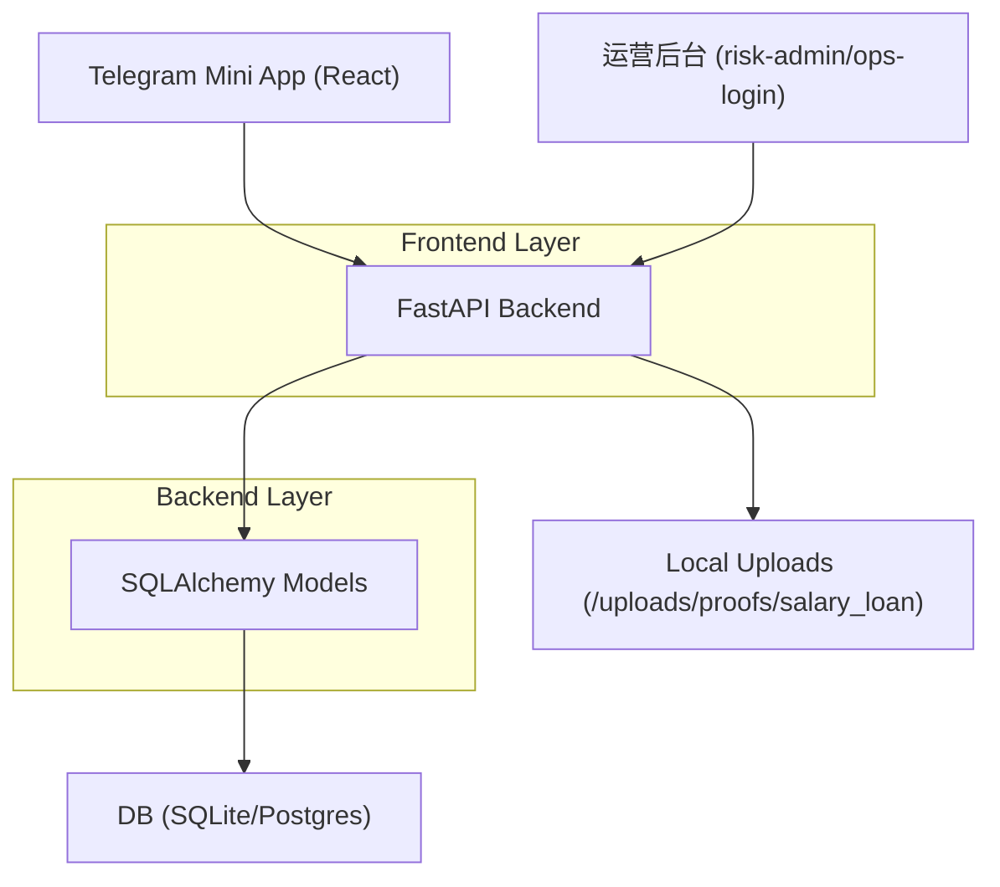
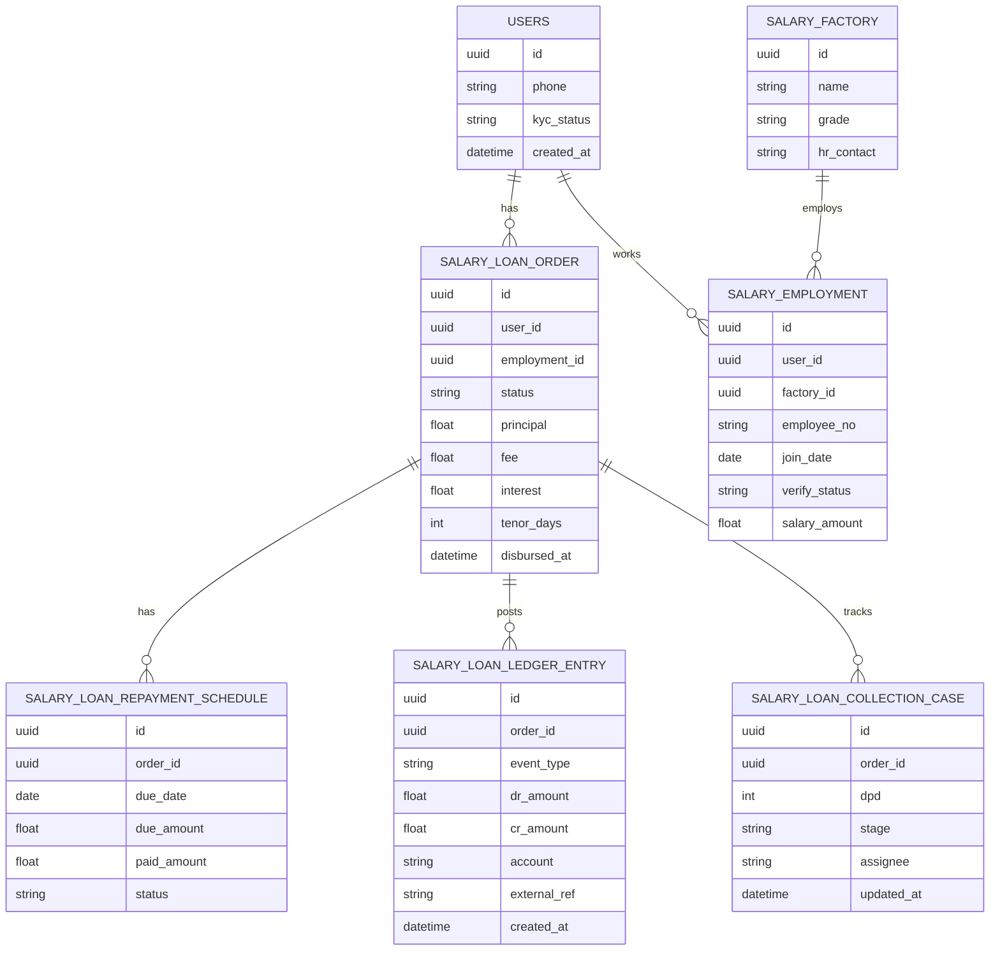

## 1.Architecture design


## 2.Technology Description
- Frontend: React@18 + TypeScript + vite + tailwindcss@3
- Backend: FastAPI + SQLAlchemy + SQLite/Postgres

## 3.Route definitions
| Route | Purpose |
|---|---|
| /salary-loan/apply | Mini App 薪资贷申请 |
| /salary-loan/order/:id | Mini App 订单详情、还款凭证上传 |
| /ops-login | 运营后台（薪资贷）登录 |
| /salary-loan | 运营后台：工厂库/订单审核/放款/核销 |

## 4.API definitions (If it includes backend services)
### 4.1 Mini App（用户）
- 查询工厂：`GET /api/v1/salary-loan/factories`
- 创建就业信息：`POST /api/v1/salary-loan/employment`
- 创建订单：`POST /api/v1/salary-loan/orders`
- 订单详情：`GET /api/v1/salary-loan/orders/{order_id}`
- 上传还款凭证：`POST /api/v1/salary-loan/orders/{order_id}/repayment-proof?amount=...&note=...`（multipart/form-data）

### 4.2 运营后台（admin）
- 登录：`POST /api/admin/login`
- 工厂库：`GET /api/admin/salary-loan/factories`、`POST /api/admin/salary-loan/factories`
- 在职验证：`POST /api/admin/salary-loan/employments/{employment_id}/verify`
- 订单列表/详情：`GET /api/admin/salary-loan/orders`、`GET /api/admin/salary-loan/orders/{order_id}`
- 审核决策：`POST /api/admin/salary-loan/orders/{order_id}/decision`
- 放款确认：`POST /api/admin/salary-loan/orders/{order_id}/disburse`
- 凭证核销：`POST /api/admin/salary-loan/proofs/{proof_id}/review`

## 6.Data model(if applicable)
### 6.1 Data model definition


### 6.2 Data Definition Language
```sql
-- 工厂
CREATE TABLE factory (
  id UUID PRIMARY KEY DEFAULT gen_random_uuid(),
  name TEXT NOT NULL,
  grade TEXT NOT NULL DEFAULT 'C',
  hr_contact TEXT,
  is_active BOOLEAN NOT NULL DEFAULT TRUE,
  created_at TIMESTAMPTZ NOT NULL DEFAULT NOW()
);

-- 就业/工厂验证
CREATE TABLE employment (
  id UUID PRIMARY KEY DEFAULT gen_random_uuid(),
  user_id UUID NOT NULL,
  factory_id UUID NOT NULL,
  employee_no TEXT,
  join_date DATE,
  verify_status TEXT NOT NULL DEFAULT 'PENDING',
  salary_amount NUMERIC,
  salary_pay_day INT,
  verified_at TIMESTAMPTZ,
  created_at TIMESTAMPTZ NOT NULL DEFAULT NOW()
);

-- 订单
CREATE TABLE loan_order (
  id UUID PRIMARY KEY DEFAULT gen_random_uuid(),
  user_id UUID NOT NULL,
  employment_id UUID,
  status TEXT NOT NULL DEFAULT 'SUBMITTED',
  principal NUMERIC NOT NULL,
  fee NUMERIC NOT NULL DEFAULT 0,
  interest NUMERIC NOT NULL DEFAULT 0,
  tenor_days INT NOT NULL,
  risk_score INT,
  decision TEXT,
  disbursed_at TIMESTAMPTZ,
  created_at TIMESTAMPTZ NOT NULL DEFAULT NOW()
);

-- 还款计划（MVP可先1期）
CREATE TABLE repayment_schedule (
  id UUID PRIMARY KEY DEFAULT gen_random_uuid(),
  order_id UUID NOT NULL,
  due_date DATE NOT NULL,
  due_amount NUMERIC NOT NULL,
  paid_amount NUMERIC NOT NULL DEFAULT 0,
  status TEXT NOT NULL DEFAULT 'DUE'
);

-- 账本分录（幂等：external_ref+event_type+order_id唯一）
CREATE TABLE ledger_entry (
  id UUID PRIMARY KEY DEFAULT gen_random_uuid(),
  order_id UUID NOT NULL,
  event_type TEXT NOT NULL,
  account TEXT NOT NULL,
  dr_amount NUMERIC NOT NULL DEFAULT 0,
  cr_amount NUMERIC NOT NULL DEFAULT 0,
  external_ref TEXT,
  created_at TIMESTAMPTZ NOT NULL DEFAULT NOW()
);
CREATE UNIQUE INDEX ledger_entry_idem
ON ledger_entry(order_id, event_type, COALESCE(external_ref,''), account);

-- 权限（示例授权）
GRANT SELECT ON factory, employment, loan_order, repayment_schedule TO anon;
GRANT ALL PRIVILEGES ON factory, employment, loan_order, repayment_schedule, ledger_entry TO authenticated;
```
