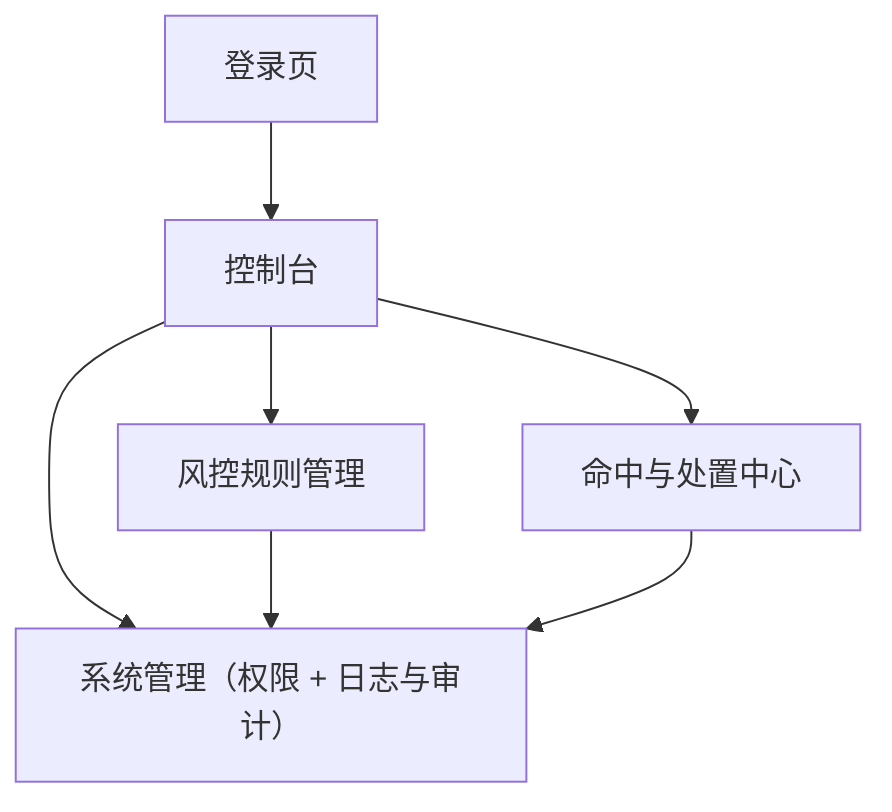

## 1. Product Overview
面向风控平台的管理后台，用于配置与发布风控规则、处理命中事件、并对所有关键操作进行日志与审计。
主要服务风控运营与管理员，确保规则变更可追溯、可回滚、可审计。

## 2. Core Features

### 2.1 User Roles
| 角色 | 注册/开通方式 | 核心权限 |
|------|--------------|----------|
| 超级管理员 | 企业邮箱邀请/SSO 开通 | 管理用户/角色/权限；管理全局配置；对全部数据读写；导出审计 |
| 风控运营 | 管理员邀请 | 管理规则（创建/编辑/测试/发布/下线）；处理命中事件（处置/备注）；查看业务日志 |
| 审计员（只读） | 管理员邀请 | 只读查看规则、命中事件与审计日志；可导出审计报表 |

### 2.2 Feature Module
本后台最小可用版本包含以下页面：
1. **登录页**：账号登录/SSO、会话管理、退出。
2. **控制台**：关键指标概览、最近告警/异常、快捷入口。
3. **风控规则管理**：规则列表、规则编辑、版本与发布记录、灰度/全量发布。
4. **命中与处置中心**：命中事件检索、事件详情、处置动作与备注、导出。
5. **系统管理（权限 + 日志与审计）**：用户/角色/权限配置、操作审计、登录与访问日志、数据导出。

### 2.3 Page Details
| Page Name | Module Name | Feature description |
|-----------|-------------|---------------------|
| 登录页 | 登录/SSO | 完成账号登录（邮箱+密码或 SSO）；在失败时提示原因；支持退出与会话过期重登 |
| 控制台 | 指标概览 | 展示今日/近7日命中量、处置完成率、规则启用数、告警数；支持按时间范围切换 |
| 控制台 | 快捷入口 | 跳转到“新建规则”“命中检索”“审计日志”；展示最近发布的规则与发布人 |
| 风控规则管理 | 规则列表 | 浏览/搜索/筛选规则（状态、标签、创建人、更新时间）；查看当前生效版本与发布状态 |
| 风控规则管理 | 规则编辑 | 创建/编辑规则基础信息（名称、描述、标签、优先级、开关）；编辑条件与动作；保存草稿 |
| 风控规则管理 | 校验与测试 | 校验必填与语法；支持用样例输入进行本地测试并展示命中结果（仅验证配置） |
| 风控规则管理 | 版本与发布 | 生成版本；发布（灰度/全量）与下线；记录发布说明；支持回滚到历史版本 |
| 命中与处置中心 | 命中检索 | 按时间、规则、对象ID、风险等级、处置状态筛选；支持分页与导出 CSV |
| 命中与处置中心 | 事件详情 | 查看命中原因、输入摘要、命中规则链、风险分；展示历史处置记录 |
| 命中与处置中心 | 处置动作 | 执行处置（放行/拦截/人工复核/加入黑白名单）；填写备注；变更后写入审计 |
| 系统管理 | 用户管理 | 邀请/停用用户；重置权限；查看用户最近登录与操作统计 |
| 系统管理 | 角色与权限 | 配置角色-权限矩阵（页面访问、规则写入、发布、导出）；为用户分配角色 |
| 系统管理 | 审计日志 | 记录并查询关键操作（规则创建/发布/回滚/处置/权限变更/导出）；支持按人/时间/对象过滤与导出 |
| 系统管理 | 登录与访问日志 | 查看登录成功/失败、IP、UA、时间；异常访问提示；用于审计追踪 |

## 3. Core Process
- 风控运营流程：登录 → 进入控制台查看告警 → 在“风控规则管理”创建/编辑规则草稿 → 校验与样例测试 → 生成版本并发布（灰度或全量）→ 在“命中与处置中心”检索命中事件并处置 → 所有操作自动写入审计日志。
- 超级管理员流程：登录 → 在“系统管理”邀请用户并分配角色权限 → 审核规则发布与回滚记录 → 定期导出审计日志归档。
- 审计员流程：登录 → 只读查看规则与命中事件 → 在“审计日志”按人/时间/对象检索并导出。

