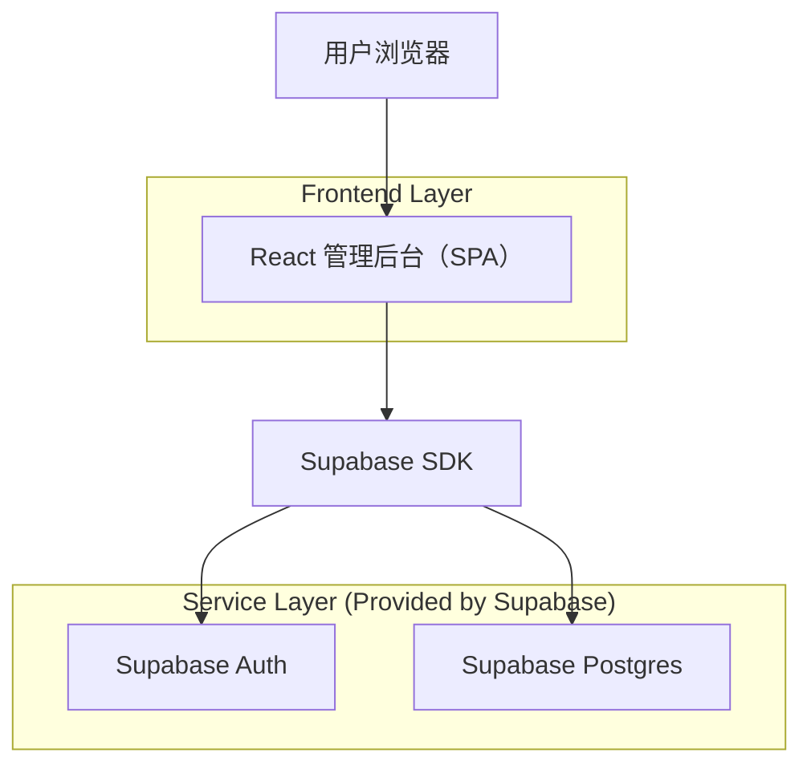
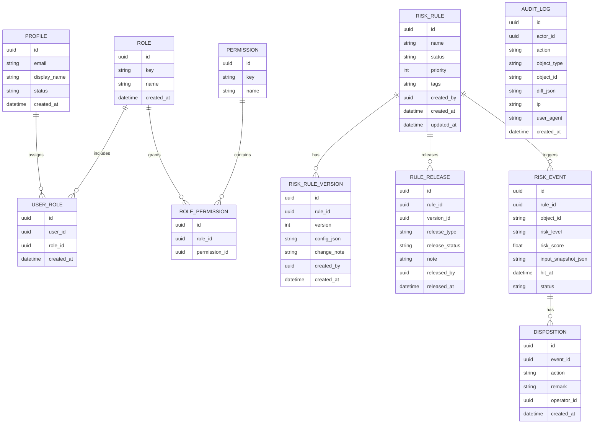

## 1.Architecture design


## 2.Technology Description
- Frontend: React@18 + TypeScript + vite + tailwindcss@3
- Backend: Supabase（Auth + PostgreSQL）

## 3.Route definitions
| Route | Purpose |
|-------|---------|
| /login | 登录与会话建立 |
| / | 控制台（指标概览、快捷入口） |
| /rules | 风控规则管理（列表、编辑、版本、发布/回滚） |
| /cases | 命中与处置中心（检索、详情、处置） |
| /system | 系统管理（用户/角色/权限 + 审计/访问日志） |

## 6.Data model(if applicable)

### 6.1 Data model definition


### 6.2 Data Definition Language
> 说明：为简化早期交付，关系通过逻辑外键（uuid 字段）维护；不强制物理外键约束。

核心权限键（示例）：
- rules.read / rules.write / rules.publish
- cases.read / cases.dispose / export.csv
- system.read / system.admin
- audit.read

```sql
-- 用户档案（与 supabase auth.users 通过同 ID 关联）
CREATE TABLE profiles (
  id UUID PRIMARY KEY,
  email VARCHAR(255) NOT NULL,
  display_name VARCHAR(100),
  status VARCHAR(20) DEFAULT 'active',
  created_at TIMESTAMPTZ DEFAULT now()
);

CREATE TABLE roles (
  id UUID PRIMARY KEY DEFAULT gen_random_uuid(),
  key VARCHAR(50) UNIQUE NOT NULL,
  name VARCHAR(100) NOT NULL,
  created_at TIMESTAMPTZ DEFAULT now()
);

CREATE TABLE user_roles (
  id UUID PRIMARY KEY DEFAULT gen_random_uuid(),
  user_id UUID NOT NULL,
  role_id UUID NOT NULL,
  created_at TIMESTAMPTZ DEFAULT now()
);
CREATE INDEX idx_user_roles_user_id ON user_roles(user_id);

CREATE TABLE permissions (
  id UUID PRIMARY KEY DEFAULT gen_random_uuid(),
  key VARCHAR(80) UNIQUE NOT NULL,
  name VARCHAR(120) NOT NULL
);

CREATE TABLE role_permissions (
  id UUID PRIMARY KEY DEFAULT gen_random_uuid(),
  role_id UUID NOT NULL,
  permission_id UUID NOT NULL
);
CREATE INDEX idx_role_permissions_role_id ON role_permissions(role_id);

CREATE TABLE risk_rules (
  id UUID PRIMARY KEY DEFAULT gen_random_uuid(),
  name VARCHAR(200) NOT NULL,
  status VARCHAR(20) DEFAULT 'draft' CHECK (status IN ('draft','enabled','disabled')),
  priority INT DEFAULT 100,
  tags TEXT,
  created_by UUID,
  created_at TIMESTAMPTZ DEFAULT now(),
  updated_at TIMESTAMPTZ DEFAULT now()
);
CREATE INDEX idx_risk_rules_status ON risk_rules(status);

CREATE TABLE risk_rule_versions (
  id UUID PRIMARY KEY DEFAULT gen_random_uuid(),
  rule_id UUID NOT NULL,
  version INT NOT NULL,
  config_json JSONB NOT NULL,
  change_note TEXT,
  created_by UUID,
  created_at TIMESTAMPTZ DEFAULT now()
);
CREATE INDEX idx_rule_versions_rule_id ON risk_rule_versions(rule_id);

CREATE TABLE rule_releases (
  id UUID PRIMARY KEY DEFAULT gen_random_uuid(),
  rule_id UUID NOT NULL,
  version_id UUID NOT NULL,
  release_type VARCHAR(20) NOT NULL CHECK (release_type IN ('canary','full','rollback','disable')),
  release_status VARCHAR(20) NOT NULL CHECK (release_status IN ('submitted','done','failed')),
  note TEXT,
  released_by UUID,
  released_at TIMESTAMPTZ DEFAULT now()
);
CREATE INDEX idx_rule_releases_rule_id ON rule_releases(rule_id);

CREATE TABLE risk_events (
  id UUID PRIMARY KEY DEFAULT gen_random_uuid(),
  rule_id UUID,
  object_id VARCHAR(120) NOT NULL,
  risk_level VARCHAR(20) NOT NULL,
  risk_score DOUBLE PRECISION,
  input_snapshot_json JSONB,
  hit_at TIMESTAMPTZ DEFAULT now(),
  status VARCHAR(20) DEFAULT 'open' CHECK (status IN ('open','processing','closed'))
);
CREATE INDEX idx_risk_events_hit_at ON risk_events(hit_at DESC);
CREATE INDEX idx_risk_events_object_id ON risk_events(object_id);

CREATE TABLE dispositions (
  id UUID PRIMARY KEY DEFAULT gen_random_uuid(),
  event_id UUID NOT NULL,
  action VARCHAR(30) NOT NULL CHECK (action IN ('allow','block','manual_review','whitelist','blacklist')),
  remark TEXT,
  operator_id UUID,
  created_at TIMESTAMPTZ DEFAULT now()
);
CREATE INDEX idx_dispositions_event_id ON dispositions(event_id);

CREATE TABLE audit_logs (
  id UUID PRIMARY KEY DEFAULT gen_random_uuid(),
  actor_id UUID,
  action VARCHAR(80) NOT NULL,
  object_type VARCHAR(50) NOT NULL,
  object_id VARCHAR(120),
  diff_json JSONB,
  ip VARCHAR(64),
  user_agent TEXT,
  created_at TIMESTAMPTZ DEFAULT now()
);
CREATE INDEX idx_audit_logs_created_at ON audit_logs(created_at DESC);
CREATE INDEX idx_audit_logs_actor_id ON audit_logs(actor_id);

-- 基础授权（示例：早期开发可先放开只读给 anon，生产建议进一步收紧并使用 RLS）
GRANT SELECT ON profiles, roles, user_roles, permissions, role_permissions, risk_rules, risk_rule_versions, rule_releases, risk_events, dispositions, audit_logs TO anon;
GRANT ALL PRIVILEGES ON profiles, roles, user_roles, permissions, role_permissions, risk_rules, risk_rule_versions, rule_releases, risk_events, dispositions, audit_logs TO authenticated;

-- 初始化角色（示例）
INSERT INTO roles (key, name) VALUES
  ('super_admin', '超级管理员'),
  ('risk_operator', '风控运营'),
  ('auditor', '审计员（只读）');
```

建议的 RLS（要点）：
- 所有表开启 RLS；默认仅 authenticated 可读。
- system.* 写入仅 super_admin；rules.publish 仅具备发布权限者；audit_logs 仅追加写入（insert-only）。
